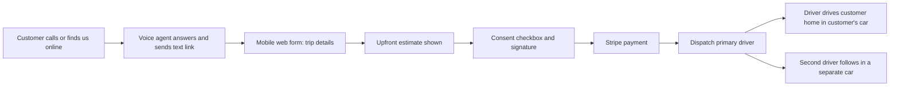
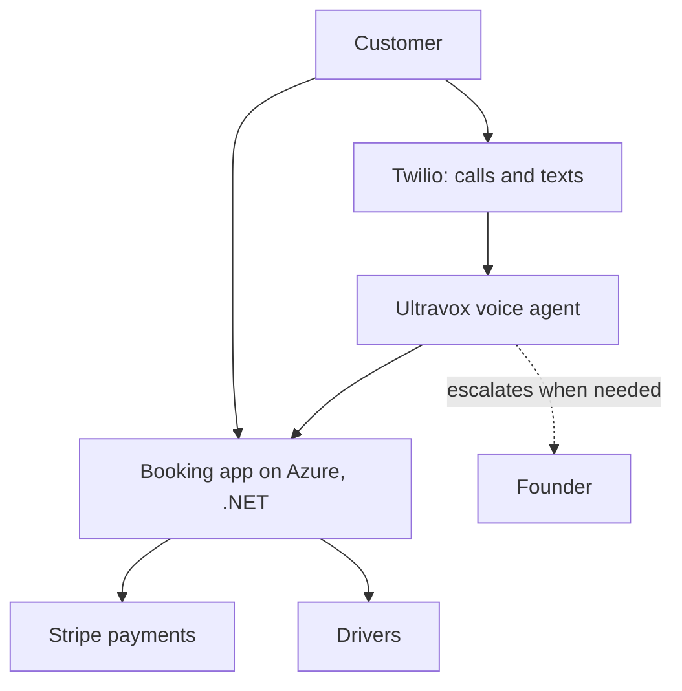

# Designated Driver Service, Calgary

A safe, paid-up-front way to get home in your own car. Two drivers, one booking, no cash or card details passed over the phone.

Living base document. Version 1, September 30, 2026. Update this file rather than starting a new one. Items marked **To confirm** are not yet verified.

[Overview](#overview)[How a trip works](#model)[Trust and safety](#trust)[Money](#money)[Market](#market)[Risks](#risks)[Funding](#funding)[Plan](#plan)[Open items](#open)

## 1. Overview

The business is live in Calgary and has one paying customer. A customer books a trip, pays before dispatch, and a registered primary driver drives the customer home in the customer's own car. A second driver follows in a separate car so the primary driver can get back.

**What is already built:**

- A .NET booking app hosted on Azure, with an upfront cost and time estimate.
- Stripe payment inside the app, taken before dispatch.
- A consent screen with a checkbox and hand-drawn signature.
- A live voice agent (Twilio and Ultravox) that answers inbound calls and escalates to the founder only when needed.

### The problem

People who have been drinking want to get home without leaving their car behind or driving it themselves. Existing options are informal. One competitor runs through a WhatsApp group and has drivers relay customers' card numbers by phone so someone else can charge them manually. That is a real security and trust failure.

### Why this business

- **Demand is visible.** Callers were turned away, and a competitor's group shows people are already buying this.
- **Trust is the differentiator.** Secure payment, signed consent, and a registered driver.
- **The tech is already working.** The voice agent and Stripe flow are in production.

### Honest outlook

A solid, profitable local Calgary business is a credible outcome. It is driver-supply-constrained and city-by-city, so it is unlikely to reach venture-scale returns. That shapes the funding approach: grants and organic reinvestment first, patient angels only if ever.

## 2. How a trip works

Current flow requires the app. The planned flow keeps every safeguard but replaces the app download with a text link and mobile web form, so phone callers are no longer turned away.

### Driver roles

| Role | Does | Vetted by company |
| --- | --- | --- |
| Primary driver | Drives the customer's car. Registered with licence and information on file. Receives the full driver payout and arranges pay for the second driver. | Yes |
| Second driver | Drives their own car or the primary driver's car, only to bring the primary driver back. Never touches the customer or the customer's car. | No, by design |

### Systems

## 3. Trust and safety model

- **Payment:** customer pays in a secure Stripe form before dispatch. Card details are never read out over the phone.
- **Consent:** customer checks a box and signs, acknowledging the company provides no extra insurance for their car. This also protects drivers against false accusations such as theft.
- **Driver accountability:** one contracted, registered primary driver per trip.
- **Insurance position:** the City of Calgary, Calgary transportation contacts, and several insurers said no dedicated insurance category applies and that the customer's own policy covers their car.

**Two gaps to close before scaling.**

- **Disclaimer wording has not been reviewed by a lawyer.** It is the main liability shield and is currently unverified.
- **Paid-driving exclusion:** some personal auto policies may exclude driving for compensation. No one has confirmed this in writing with a broker. **To confirm.**

## 4. Money

### Pricing and split

Trips are priced at about $60 to $100. The working plan is that the company keeps $30 and the primary driver receives the rest. On a $60 trip that is $30 and $30. The company does not manage how the primary driver pays the second driver.

| Trip price | Company keeps | Primary driver | Company share |
| --- | --- | --- | --- |
| $60 | $30 | $30 | 50% |
| $80 | $30 | $50 | 38% |
| $100 | $30 | $70 | 30% |

Assumes a flat $30 company amount. **To confirm** whether the company amount is flat or a percentage, and whether the driver payout is fixed or tiered.

### Cost stack

| Item | Type | Monthly or per-trip cost |
| --- | --- | --- |
| Azure hosting | Usage | To confirm |
| Stripe | Per transaction, percentage plus fixed fee | To confirm current rate |
| Twilio | Per call and text | To confirm |
| Ultravox voice agent | Per minute | To confirm |
| Insurance | None purchased | $0 (see gaps above) |
| Marketing and driver recruitment | Discretionary | Intended to be grant-funded |
| Google Ads unpaid invoice | One-time | $500 |

No revenue or profit projections are included. They would be invented without real inputs. Once the cost rows above are filled in and a realistic weekly trip count is chosen, add a projection here.

## 5. Market and competition

- One known informal competitor on WhatsApp, organizer possibly outside Canada, with unsafe phone-based card handling.
- Other players exist but are not yet identified. **To confirm** by mystery-shopping calls before any grant application.
- Ride-hailing and taxis are not direct substitutes, since the customer's car must get home too.

**Ad intent problem.** Many callers from the Google campaign wanted a cab, not a designated driver. The fix is tighter keyword match types and negative keywords such as cab and taxi.

## 6. Risks

| Risk | Why it matters | Response |
| --- | --- | --- |
| Unreviewed disclaimer | Main liability shield may be unenforceable | Flat-fee review by an Alberta lawyer |
| Insurance gap | Claim could be denied on a paid-driving exclusion | Written answer from a commercial broker |
| Frozen Google Ads account | Main marketing channel is offline | Pay the $500 invoice, rebuild campaign |
| Driver supply | Growth is capped by available drivers | Recruit ahead of marketing |
| Unknown competitors | Grant reviewers will ask | Research and mystery shopping |
| Booking friction | App-only intake turned callers away | Text-link web form |

## 7. Funding approach

The stated preference is non-repayable money: grants first, not loans or investors. The immediate need is a grant to pay for driver recruitment and advertising, because people do not yet know the service exists.

Seed equity is not repaid, and investors profit on a sale, but dilution and exit expectations apply. Venture funds need large exits, which does not fit this business. Patient angels are a better match if equity is ever used. The AI voice agent is a credibility point, not the core pitch. Smart dispatch is a later idea that only pays off at scale.

**No specific grant programs are verified yet.** Search was unavailable. Programs worth checking: Alberta Innovates, NRC IRAP, Innovate Calgary, Platform Calgary, Community Futures, and local chamber or city small-business programs. The Canada Small Business Financing Program is a loan, not a grant. Confirm names, amounts, and eligibility before relying on any of them.

## 8. Plan

### Phase 1: Fix the foundations (next 2 weeks)

- Pay the $500 Google invoice to unfreeze ads.
- Book a flat-fee lawyer review of the consent disclaimer.
- Ask a commercial broker about the paid-driving exclusion, and get the answer in writing.

### Phase 2: Remove booking friction (weeks 2 to 6)

- Build the phone to text link to web form to sign to pay to dispatch flow. Keep the consent step intact.
- Mystery-shop competitors and record pricing, payment handling, and wait times.
- Relaunch ads with tighter keywords and negative keywords.

### Phase 3: Funding and growth (weeks 6 to 12)

- Verify grant programs, then apply using this document as the base.
- Use the grant for driver recruitment and advertising.
- Goal: about 50 customers.

### Phase 4: Later

- Social media and video marketing.
- Smart dispatch only once volume justifies it.
- Consider other cities only after Calgary is working.

## 9. Open items and update log

### Inputs still needed

- Flat or percentage company take, and exact driver payout rules.
- Monthly costs for Azure, Twilio, and Ultravox, and the Stripe rate.
- Realistic trips per week for the first three months.
- Number and type of drivers recruited so far.
- Claude plan choice and usage limits, which were not verified.

### Update log

| Date | Change |
| --- | --- |
| Sep 30, 2026 | Version 1 created from the founder discussion. |