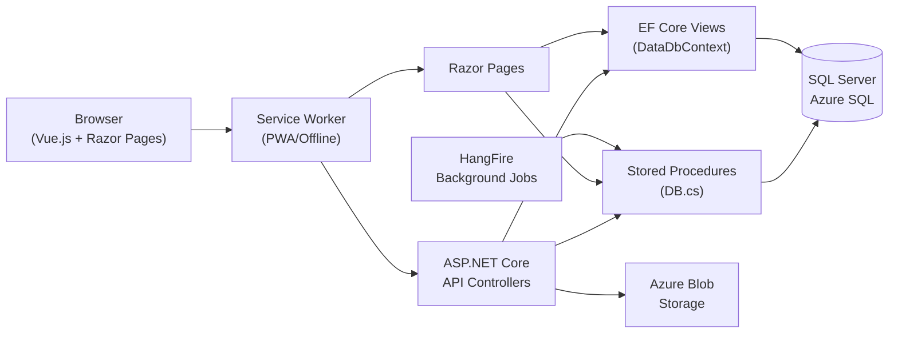

# FieldPro / RiseFSM — System Overview

> **Entry point for the entire knowledge base.** Start here.

## System at a Glance

**FieldPro** (codebase namespace: `RiseFSM`) is a **multi-tenant SaaS field service management platform** built for the oil & gas well intervention, wireline, and completions industry.

| What | Detail |
|---|---|
| **Product name** | FieldPro / RiseFSM |
| **Target industry** | Oil & gas well services (wireline, coiled tubing, completions, WI) |
| **Users** | Field supervisors, dispatchers, engineers, safety officers, managers, executives |
| **Architecture** | Multi-tenant SaaS, Offline-capable PWA |
| **Hosting** | Azure App Service |
| **Primary language** | C# (.NET 8) + TypeScript/Vue.js 2 |
| **Database** | SQL Server (Azure SQL) |

---

## Major Applications

| Layer | Technology | Role |
|---|---|---|
| Web Server | ASP.NET Core 8 Razor Pages | Main app, Razor UI, all API endpoints |
| Frontend SPA | Vue.js 2 + TypeScript (`ClientLibrary`) | Dynamic UI components compiled to `wwwroot/js/v99/dist/` |
| Database | SQL Server SSDT (`Database.sqlproj`) | All schema, stored procs, views, functions |
| Background Jobs | HangFire (production only) | Scheduled jobs: daily reports, expiry checks, currency refresh |
| Reporting | DevExpress XtraReports + Dashboard | Report designer/viewer, stored in Azure Blob |

---

## Major Technologies

- **ASP.NET Core 8** — Razor Pages (not MVC), API controllers, Identity
- **Vue.js 2 + TypeScript** — all interactive UI; webpack bundled
- **SQL Server** — stored procedures are the primary data access path
- **EF Core** — used for views and select models only (`DataDbContext`)
- **ADO.NET (`DB.cs`)** — primary data access via stored procedures
- **HangFire** — background job scheduling (non-DEBUG only)
- **DevExpress** — UI grids, reporting, dashboards
- **Serilog** — structured logging
- **Azure Blob Storage** — file storage (reports, logos, uploads)
- **SendGrid** — transactional email
- **Okta** — SSO/SAML integration (per-tenant optional)
- **OneSignal** — push notifications
- **Application Insights** — telemetry

---

## Main Data Flow

---

## Multi-Tenant Architecture

Every request carries a **TenantID** resolved from the authenticated user's claims. All domain objects are tenant-scoped. Database queries always filter by `TenantID`. See [[Multi-Tenancy]] for details.

---

## Offline / PWA

The application supports **offline operation** for field personnel without connectivity. A service worker intercepts requests, IndexedDB stores local data, and a sync process uploads changes when connectivity is restored. See [[Offline PWA Architecture]] for details.

---

## Key Business Domains

| Domain | Description |
|---|---|
| [[Jobs Feature]] | Core work order — well intervention job lifecycle |
| [[Daily Tickets Feature]] | Field billing tickets attached to jobs |
| [[Load Out Feature]] | Equipment/tool dispatch for jobs |
| [[Service Design Feature]] | MOC / JSA pre-job safety and design |
| [[Safety Feature]] | Incident reporting, inspections, permits |
| [[Supply Chain Feature]] | Assets, products, inventory, purchase orders |
| [[Timesheets Feature]] | Employee time tracking |
| [[Reporting Feature]] | DevExpress reports + dashboards |
| [[Sales / CRM Feature]] | Customer relationship and opportunity management |

---

## Navigation

- [[Knowledge Base Index]] — complete map of the vault
- [[System Architecture]] — how the layers connect
- [[Data Access Pattern]] — how the app talks to the database
- [[Multi-Tenancy]] — tenant isolation design
- [[Offline PWA Architecture]] — offline-first design
- [[Development Guide]] — how to run and develop locally
- [[Security Overview]] — authentication and authorization
- [[Troubleshooting Index]] — known problems and fixes
- [[Architecture Decision Records]] — why it was built this way

---

## Related

- [[Backend Overview]]
- [[Frontend Overview]]
- [[Database Overview]]
- [[Infrastructure Overview]]
- [[Integrations Overview]]
