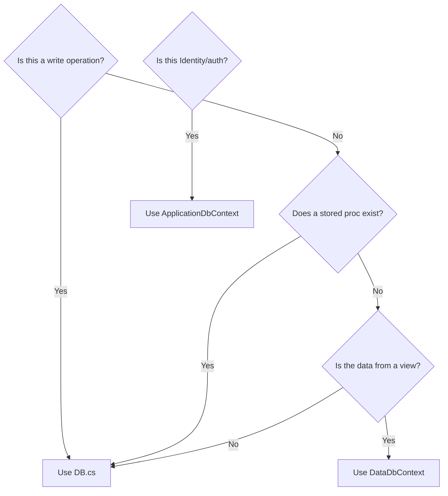

# Data Access Pattern

## Overview

FieldPro uses **two parallel data access mechanisms**. Understanding when each is used is essential.

| Mechanism | Class | Used For |
|---|---|---|
| **ADO.NET + Stored Procs** | `DB.cs` | All writes, complex reads, offline data, primary path |
| **EF Core** | `DataDbContext` | View-backed read models, select filtered queries |

> **Rule of thumb:** If there is a stored procedure for it, use `DB.cs`. EF Core is used only for views and a few specific table models where the ORM convenience is worth it.

---

## DB.cs — Primary Data Access

**Location:** `Web/Services/DB.cs` (821 lines)

`DB` is a **scoped, disposable ADO.NET wrapper** around `SqlConnection` + `SqlTransaction`. It is constructed with the connection string, `tenantID`, and `userID` so every call is automatically tenant-aware.

### Key Methods

| Method | Purpose |
|---|---|
| `ExecuteReader(spName, params)` | Execute SP returning `SqlDataReader` |
| `ExecuteScalar(spName, params)` | Execute SP returning single value |
| `Execute(spName, params)` | Execute SP with no return (or Action enum) |
| `Begin()` | Open connection, begin transaction |
| `Commit()` | Commit transaction |
| `Rollback()` | Rollback transaction |
| `Clone()` | Create new DB instance with same connection info |

### DB.Action Enum

```csharp
public enum Action {
	Insert,
	InsertNOSurrogateKey,
	Update,
	Delete,
	DeleteByID,
	SelectID,
	SelectCount,
	QuearyOutParameters,
	Default   // returns rows affected
}
```

### Typical Usage Pattern

```csharp
// In a Domain class constructor:
public Job(string connectionString, int tenantID, int userID)
{
	_db = new DB(connectionString, tenantID, userID);
	_tenantID = tenantID;
	_userID = userID;
}

// Reading:
SqlParameter[] parameters = {
	AddParameter("@TenantID", _tenantID),
	AddParameter("@JobID", jobID)
};
using (SqlDataReader reader = _db.ExecuteReader(SP.Job_Select, parameters))
{
	// map reader to model
}

// Transaction:
_db.Begin();
// ... multiple operations
_db.Commit();
```

### Stored Procedure Names

SP names are referenced via a static `SP` class (constants), e.g., `SP.Job_SelectAll`, `SP.Job_Insert`. This avoids magic strings.

---

## DataDbContext — EF Core (Views & Select Models)

**Location:** `Web/Data/DataDbContext.cs` (1435 lines)

`DataDbContext` is the EF Core `DbContext` for reading view-backed models. It is **not** the primary write path.

### Key Design Decisions

- Most entities are mapped to **views** (`ToView("vXxx")`)
- Global query filters enforce tenant isolation: `.HasQueryFilter(m => m.TenantID == GetTenantIDDbContext())`
- Tenant ID is resolved via `DataContextTenantProviderService` from the HTTP context
- Custom value converters handle JSON extra-data fields and UOM pairs
- UTC date conversion applied via `UtcDateTimeConverter`

### ApplicationDbContext

**Location:** `Web/Data/ApplicationDbContext.cs`

Thin wrapper around `IdentityDbContext` — used exclusively for **ASP.NET Identity** (users, roles, claims). No domain entities here.

---

## When to Use Which



---

## Tenant Isolation in Data Access

- `DB.cs`: `_tenantID` is passed as `@TenantID` parameter in every SP call
- `DataDbContext`: Global query filter `m.TenantID == GetTenantIDDbContext()` on every entity
- `ApplicationDbContext`: Identity tables are shared — tenant association is in the claims

See [[Multi-Tenancy]] for the full picture.

---

## Related

- [[DB Service]]
- [[DataDbContext]]
- [[Multi-Tenancy]]
- [[Domain Classes]]
- [[Stored Procedures]]
- [[System Architecture]]
