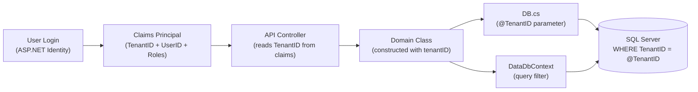

# Multi-Tenancy

## Overview

FieldPro is a **multi-tenant SaaS platform**. Every tenant (client company) has complete data isolation from every other tenant. Tenancy is enforced at every layer: authentication, business logic, data access, and database queries.

---

## Tenant Identity

| Concept | Storage |
|---|---|
| Tenant definition | `tTenant` database table |
| Tenant key (URL slug) | `tTenant.TenantKey` — used in routes like `/xyz/jobs` |
| TenantID (integer FK) | Stored in every data table |
| Current user's TenantID | Resolved from ASP.NET Identity claims |

---

## How TenantID Flows Through the System



---

## Enforcement Points

### 1. ASP.NET Identity Claims
On login, `TenantID` is added to the user's claims. All subsequent requests carry this claim via the auth cookie.

### 2. DB.cs Constructor
```csharp
public DB(string connectionString, int tenantID, int userID)
```
Every domain class passes `tenantID` when constructing `DB`. Every stored procedure call receives `@TenantID` as a parameter.

### 3. Stored Procedures
All SPs include `@TenantID INT` as a parameter and filter all queries with `WHERE TenantID = @TenantID`.

### 4. EF Core Global Query Filters
```csharp
modelBuilder.Entity<Models.BusinessUnit>()
	.HasQueryFilter(m => m.TenantID == GetTenantIDDbContext());
```
Applied in `DataDbContext.OnModelCreating()` for every mapped entity. `GetTenantIDDbContext()` resolves the current tenant from `DataContextTenantProviderService`.

### 5. DataContextTenantProviderService
Service that resolves TenantID from the current HTTP context's claims. Used by `DataDbContext` so EF Core always filters to the correct tenant without requiring explicit parameters.

---

## Per-Tenant Branding

Tenants have their own branding assets stored at:
```
wwwroot/xyz/{tenantKey}/
	logo.png
	theme.css
	manifest.json
```

Tenant-specific themes are managed by `ThemeBuilderService` (HangFire background job).

---

## Tenant Configuration

The `tTenant` table stores per-tenant settings including:
- `TenantKey` — URL slug
- `IsActive`
- Okta SSO configuration references (`TenantOkta` table)
- Feature flags and module enables

---

## Security Considerations

- A user **cannot** change their TenantID claim without re-authenticating
- API controllers resolve TenantID from claims — never from request body or query string
- EF Core filters are global and cannot be bypassed without calling `IgnoreQueryFilters()` (only done for admin/cross-tenant operations — **TODO: Verify**)

---

## Related

- [[Security Overview]]
- [[Authentication Flow]]
- [[Data Access Pattern]]
- [[DB Service]]
- [[DataDbContext]]
- [[System Architecture]]
- [[ADR - Multi-Tenant Design]]
