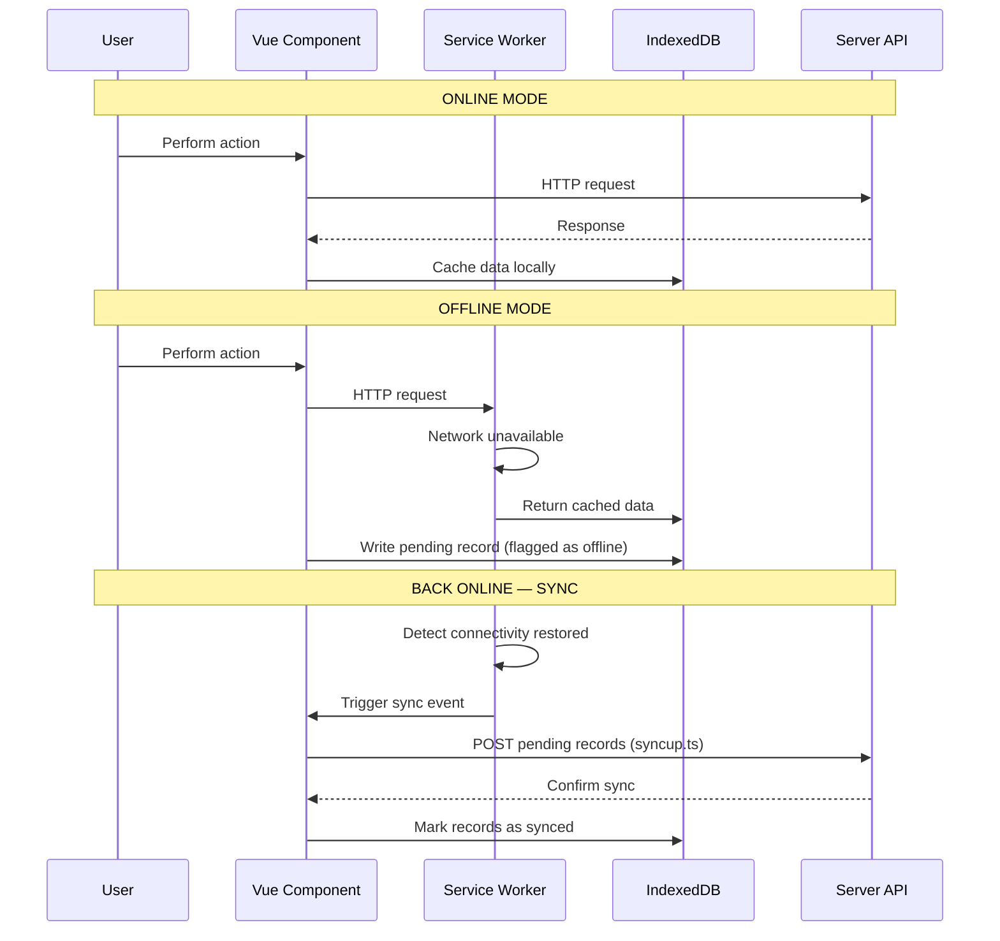

# Offline PWA Architecture

## Overview

FieldPro is designed to work **offline in the field** where internet connectivity is unreliable. It is a Progressive Web App (PWA) with a service worker, IndexedDB local storage, and a bidirectional sync mechanism.

---

## Components

| Component | Location | Role |
|---|---|---|
| Service Worker | `Web/wwwroot/service-worker-v33.js` (latest) | Intercepts network requests, serves cached responses |
| IndexedDB | `ClientLibrary/src/indexdb/` | Local persistent storage in the browser |
| Sync Engine | `ClientLibrary/src/syncup.ts` | Pushes local changes to server on reconnect |
| Offline API routes | `Web/API/Offline/` | Server-side endpoints for offline record handling |
| Offline history | `tXYZOfflineRecordHistory` tables | Tracks records created/modified offline |

---

## How Offline Works

---

## Service Worker Versions

Service workers are versioned (`service-worker-v33.js`). When a new version is deployed, the browser detects the new SW file and prompts the user to refresh. The version number in the filename **must be incremented** on each deploy that changes the SW or its cache list.

> **TODO: Verify** — confirm the version-bump process is manual or automated in the pipeline.

---

## IndexedDB Structure

Located in `ClientLibrary/src/indexdb/`. Each domain area has its own IndexedDB object store. Common stores include:

- Jobs
- Daily Tickets
- Load Out
- Reference/lookup tables (cached on login)

---

## Offline Job Numbers

Offline job number generation is handled on the client to avoid conflicts. When the record syncs to the server, the offline number is reconciled with the server-assigned number.

> **TODO: Verify** — confirm the exact reconciliation mechanism in `syncup.ts`.

---

## Sync Process (`syncup.ts`)

1. Detects online status via `navigator.onLine` / network event
2. Reads all pending records from IndexedDB (flagged as unsynced)
3. POSTs each record to the corresponding offline API endpoint
4. On success, marks the IndexedDB record as synced
5. Notifies the UI of sync completion

See also `SyncOffline.vue` for the UI component that displays sync status.

---

## Failure Handling

- If sync fails (server error), records remain in IndexedDB flagged as pending
- Conflict resolution: **TODO: Verify** — the strategy for handling server-side conflicts during sync
- The `tXYZOfflineRecordHistory` tables on the server track offline record lifecycle

---

## Related

- [[Frontend Overview]]
- [[Offline Sync Workflow]]
- [[Offline Sync Issues]]
- [[Vue Components]]
- [[API Controllers]]
