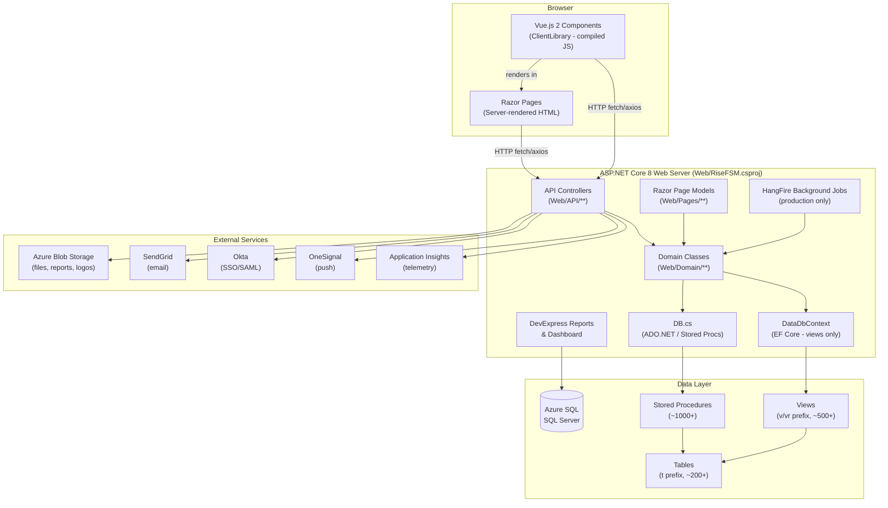
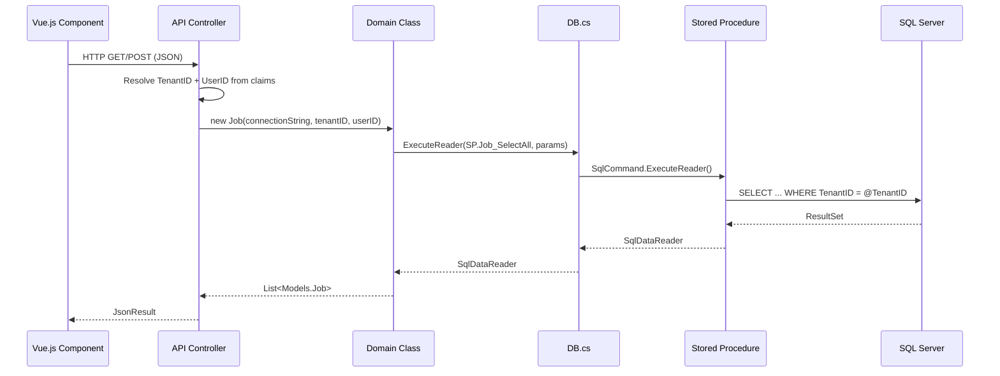

# System Architecture

## Overview

FieldPro is a **layered, multi-tenant SaaS application** with three physical projects and a clear separation of concerns across presentation, API, domain, data access, and database layers.

---

## Project Structure

| Project | Path | Role |
|---|---|---|
| Web app | `Web/RiseFSM.csproj` | ASP.NET Core 8 — all server-side code |
| Frontend | `ClientLibrary/ClientLibrary.esproj` | Vue.js 2 + TypeScript SPA components |
| Database | `Database/Database.sqlproj` | SQL Server SSDT — schema, SPs, views |

> The Database project is **excluded from the solution build** by default. Build it separately to validate SQL. See [[Database Project]].

---

## Layer Responsibilities

### Razor Pages (`Web/Pages/`)
- Server-rendered page shells
- Authentication guards via `[Authorize]` attributes
- Page models (`LoggedInTenantPageModel` base class) handle SSR data
- Vue components are mounted inside Razor Page `.cshtml` files

### API Controllers (`Web/API/`)
- JSON REST endpoints consumed by Vue components
- All inherit from `APIControllerBase`
- Grouped by domain: `Jobs/`, `Fleet/`, `Safety/`, `Sales/`, `SupplyChain/`, `Shared/`, `Reporting/`, `Quality/`, `Timesheet/`, `User/`
- See [[API Controllers]]

### Domain Classes (`Web/Domain/`)
- Business logic lives here — **NOT in controllers**
- Each domain class (e.g., `Job.cs`, `DailyTicket.cs`) wraps DB calls and business rules
- Constructed with `connectionString`, `tenantID`, `userID`
- See [[Domain Classes]]

### DB Service (`Web/Services/DB.cs`)
- Thin ADO.NET wrapper over `SqlConnection` + `SqlCommand`
- Executes stored procedures by name using `SqlParameter[]`
- Supports transactions (`Begin()`, `Commit()`, `Rollback()`)
- See [[DB Service]]

### DataDbContext (`Web/Data/DataDbContext.cs`)
- EF Core used **selectively** for views and a few tables
- Global query filters enforce tenant isolation on mapped entities
- Used alongside `DB.cs` — not as a replacement
- See [[DataDbContext]]

### Background Services (`Web/Services/HangFire/`)
- HangFire registered in production only (`#if !DEBUG`)
- Services: `DailyReportService`, `WeeklyExpiryService`, `TenantCurrencyRefreshService`, `ExecuteDatabaseStoredProcService`, `ThemeBuilderService`, `JobSchedulerService`
- See [[Background Services]]

---

## Request Flow (API call)

---

## Authentication Flow Summary

1. User navigates to app → Razor Page enforces `[Authorize]`
2. ASP.NET Identity checks cookie session
3. If not authenticated → redirect to login page
4. Optional: Okta SAML SSO for tenants configured with `TenantOkta`
5. On login success → claims principal populated with `TenantID`, `UserID`, roles
6. All subsequent API calls carry cookie (or Bearer token for API routes)

See [[Authentication Flow]] and [[Security Overview]].

---

## Multi-Tenancy Summary

Every DB call passes `@TenantID` parameter. EF Core entities have global query filters. No tenant can access another tenant's data. See [[Multi-Tenancy]].

---

## Offline PWA Summary

Service worker intercepts API calls when offline. Vue components write to IndexedDB. On reconnect, `syncup.ts` pushes pending records. See [[Offline PWA Architecture]].

---

## Related

- [[Data Access Pattern]]
- [[Multi-Tenancy]]
- [[Offline PWA Architecture]]
- [[API Controllers]]
- [[Domain Classes]]
- [[DB Service]]
- [[Background Services]]
- [[Security Overview]]
