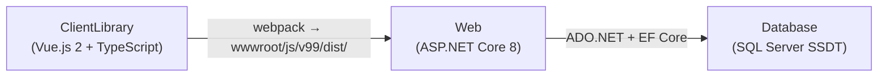

# Applications Overview

FieldPro is composed of **three Visual Studio projects** that work together.

---

## Projects

### 1. Web — `Web/RiseFSM.csproj`

The main ASP.NET Core 8 application. Contains:

| Area | Path | Description |
|---|---|---|
| Entry point | `Web/Program.cs` | App bootstrap, middleware pipeline |
| Service registration | `Web/ServicesConfig/` | 20+ extension methods, one per concern |
| Razor Pages | `Web/Pages/` | Server-rendered page shells + SSR page models |
| API Controllers | `Web/API/` | JSON REST endpoints for Vue components |
| Domain classes | `Web/Domain/` | Business logic (300+ classes) |
| EF Models | `Web/Models/` | DTOs and EF-mapped models |
| Data contexts | `Web/Data/` | `ApplicationDbContext` (Identity) + `DataDbContext` (views) |
| Services | `Web/Services/` | `DB.cs`, HangFire jobs, email, notifications, PDF, geo |
| Reports | `Web/Reports/` | DevExpress report definitions |
| Static assets | `Web/wwwroot/` | JS bundles, CSS, images, tenant branding |

**Target framework:** `.NET 8`

See [[Web Application]] for full detail.

### 2. ClientLibrary — `ClientLibrary/ClientLibrary.esproj`

The TypeScript + Vue.js 2 frontend library. Contains:

| Area | Path | Description |
|---|---|---|
| Vue pages | `ClientLibrary/src/pages/` | Top-level page components (Jobs, Tickets, etc.) |
| Vue components | `ClientLibrary/src/components/` | Reusable UI components |
| TypeScript models | `ClientLibrary/src/models/` | Typed DTOs matching server models |
| API clients | `ClientLibrary/src/api/` | Typed HTTP fetch modules |
| IndexedDB | `ClientLibrary/src/indexdb/` | Offline storage layer |
| Sync | `ClientLibrary/src/syncup.ts` | Offline → online sync engine |
| Build output | `Web/wwwroot/js/v99/dist/` | Webpack bundle destination |

See [[Client Library]] for full detail.

### 3. Database — `Database/Database.sqlproj`

SQL Server Data Tools (SSDT) project. Contains all schema objects:

| Object type | Naming prefix | Approximate count |
|---|---|---|
| Tables | `t` | ~200 |
| Views | `v` / `vr` (report views) | ~500 |
| Stored procedures | none (by domain) | ~1000 |
| Functions | none | ~80 |
| Triggers | none | ~30 |
| Audit tables | `ta` | ~50 |
| Enum/lookup tables | `e` / `tc` | ~40 |

> **Important:** The Database project is **excluded from the default solution build**. Always build it separately to validate SQL changes.

See [[Database Project]] and [[Database Overview]].

---

## How Projects Connect

- **ClientLibrary** compiles to JS bundles that are served by the Web project
- **Web** connects to the database at runtime via connection strings
- **Database** is deployed independently (via Azure DevOps pipeline)

---

## Related

- [[Web Application]]
- [[Client Library]]
- [[Database Project]]
- [[System Architecture]]
- [[Build and Deploy]]
