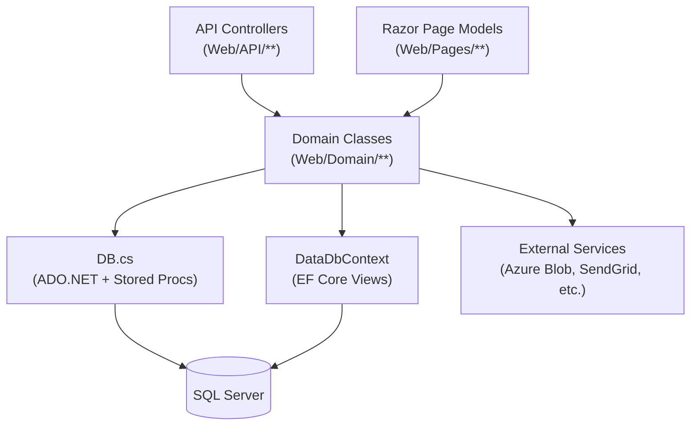

# Backend Overview

## Summary

The backend is an **ASP.NET Core 8 application** using a **Domain / Service / Data Access** layering. Business logic lives in domain classes. Data access goes through `DB.cs` (stored procedures) or `DataDbContext` (EF Core views). API controllers are thin orchestrators.

---

## Layers

---

## Key Components

| Component | See |
|---|---|
| API Controllers | [[API Controllers]] |
| Domain Classes | [[Domain Classes]] |
| DB.cs ADO.NET service | [[DB Service]] |
| EF Core context | [[DataDbContext]] |
| Service registration | [[ServicesConfig]] |
| Background jobs | [[Background Services]] |

---

## Important Services

| Service | Role |
|---|---|
| `DB.cs` | ADO.NET stored procedure executor |
| `DataContextTenantProviderService` | Resolves TenantID for EF Core filters |
| `LSDQueryService` | **TODO: Verify** — appears to be a lookup/reference data service |
| `GeoCodeRequestService` | Geographic coordinate lookup |
| `NotificationService` | OneSignal push notification sender |
| `PDFMakeServices.SDRevisionPDFService` | Generates PDFs via Node.js + pdfmake |
| `Email` | SendGrid email service |
| `Secrets` | Provides connection strings and sensitive config |

---

## Secrets / Configuration

`Secrets` is a service that wraps sensitive configuration values (connection strings, API keys). It is registered as a singleton and injected where needed. API controllers receive it via `APIControllerBase(Secrets secrets)`.

---

## Error Handling

- `APIControllerBase.HandleException(Exception)` — catches exceptions and returns a `JsonResult` with error info; also logs to the database
- `APIControllerBase.HandleInvalidUser()` — returns 403-style response
- `LoggedInTenantPageModel` has equivalent exception handling for Razor Pages
- Serilog captures all errors; in production, critical errors are also emailed via `SendToAdminErrorSink`

---

## Related

- [[System Architecture]]
- [[API Controllers]]
- [[Domain Classes]]
- [[DB Service]]
- [[DataDbContext]]
- [[ServicesConfig]]
- [[Background Services]]
- [[Security Overview]]
