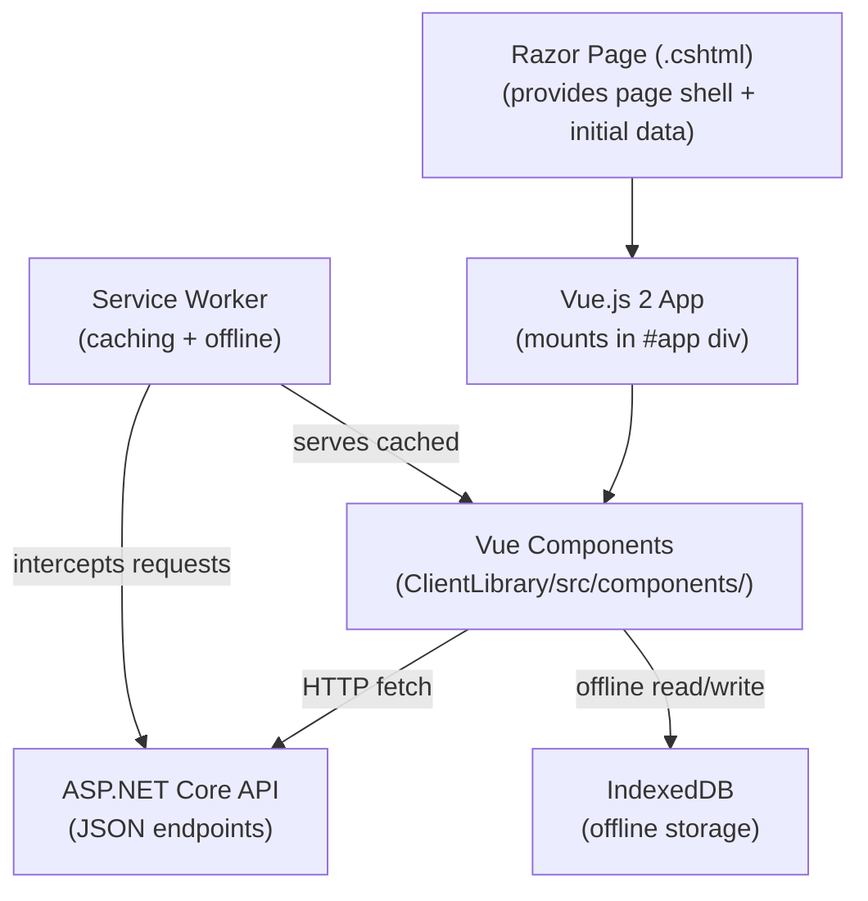

# Frontend Overview

## Summary

The FieldPro frontend is a **Vue.js 2 + TypeScript** application compiled from the `ClientLibrary` project. It runs inside Razor Page shells and communicates with ASP.NET Core API controllers via HTTP.

---

## Architecture



---

## Key Frameworks

| Framework | Version | Purpose |
|---|---|---|
| Vue.js | 2.x | Component framework |
| TypeScript | ~4.x | Type safety |
| DevExtreme | — | UI grids, forms, charts (DxDataGrid, DxForm, etc.) |
| Bootstrap-Vue | — | Bootstrap 4 layout components |
| Vuelidate | — | Form validation |
| Webpack | — | Module bundling |
| Axios / fetch | — | HTTP client |
| pdfmake | — | Client-side PDF generation |

---

## Component Organization

```
ClientLibrary/src/
	pages/              # Page-level components (one per Razor Page)
	components/
		jobs/           # Job-related reusable components
		tickets/        # Daily ticket components
		loadout/        # Load out components
		safety/         # Safety components
		supply-chain/   # Supply chain components
		shared/         # Cross-cutting: modals, grids, inputs
		...
	models/             # TypeScript interfaces (DTOs)
	api/                # Typed HTTP modules
	store/              # Vuex global state
	indexdb/            # IndexedDB abstraction
```

---

## How Pages Work

1. User navigates to a URL (e.g., `/jobs/index`)
2. ASP.NET Core routes to a Razor Page
3. Razor Page model runs server-side (auth check, optional SSR data)
4. Page renders HTML shell + `<script>` tags mounting Vue
5. Vue app initializes, loads data via API calls, renders interactive UI
6. User interactions trigger more API calls

---

## Global State (Vuex Store)

The Vuex store holds application-wide state including:
- `store.debugging` — gates developer/testing-only UI controls
- Authenticated user info
- Tenant configuration
- Cached reference data

---

## Debugging UI Controls

Per project convention:
> Only show developer/testing-only UI controls when `store.debugging` is `true`.

This flag is typically only `true` in local development or when explicitly enabled.

---

## API Client Layer

Each domain has a typed API module:
```
ClientLibrary/src/api/
	JobApi.ts
	DailyTicketApi.ts
	LoadOutApi.ts
	...
```

These modules wrap `fetch`/`axios` and return typed `Promise<T>` results matching server DTOs.

See [[API Client Layer]].

---

## Offline Capability

Vue components are aware of online/offline state. When offline:
- Reads come from IndexedDB
- Writes are queued in IndexedDB with a "pending sync" flag
- UI shows sync status via `SyncOffline.vue`

See [[Offline PWA Architecture]] and [[Offline Sync]].

---

## Related

- [[Client Library]]
- [[Vue Components]]
- [[API Client Layer]]
- [[Offline Sync]]
- [[Offline PWA Architecture]]
- [[Backend Overview]]
