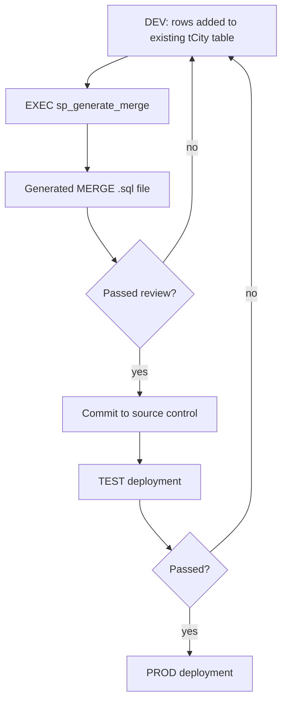

# Generate MERGE Scripts with sp_generate_merge

> [!info] Repository
> **https://github.com/dnlnln/generate-sql-merge**
> MIT licensed. Created and maintained by Daniel Nolan ([danielnolan.io](https://danielnolan.io)).
> Forked from `sp_generate_inserts` by Narayana Vyas Kondreddi.

## Overview

`sp_generate_merge` is a **single-file SQL Server stored procedure**. You point it at a table that **already exists**, and it reads the rows currently in that table and emits a `MERGE` script containing that data.

```sql
EXEC [MyDatabase]..[sp_generate_merge]
    @schema     = 'dbo',
    @table_name = 'tCity';
```

> [!warning] It does not create anything
> `sp_generate_merge` **generates data scripts only**. It does **not** create the table, the schema, or any DDL. The target table must already exist in the environment you are deploying to, and the generated `MERGE` has to match that existing structure.

---

## Why It Is Useful

The problem it solves: you have reference/static data in one environment and need the same rows in another.

Reference and lookup data is edited by hand during development. A few cities get added in DEV, a status value gets renamed, an enum row gets retired. Nobody writes the `INSERT` statements for TEST and PROD by hand, and nobody remembers what changed.

The workflow this enables:

1. Add or correct rows in the DEV table.
2. Generate a `MERGE` script from that table.
3. Review the script, check it into source control.
4. Run it against TEST, then PROD.

Because the output is a plain `.sql` file, it drops straight into an SSDT database project alongside the schema, or into a release script folder — see [[Database Project]].

> [!note] FieldPro mapping
> The `tCity` example below is a generic name. Under our own [[Database Naming Conventions]], a city lookup table would be `tcCity` (code/lookup prefix) and small enum-style sets use the `e` prefix — e.g. `eJobType`.

### Example: `tCity`

Given a lookup table that already exists in DEV:

```sql
-- tCity (already exists in DEV)
CREATE TABLE [dbo].[tCity] (
    [CityID]   INT IDENTITY(1,1) NOT NULL,
    [CityName] NVARCHAR(100) NOT NULL,
    [Region]   NVARCHAR(100) NULL,
    CONSTRAINT [PK_tCity] PRIMARY KEY CLUSTERED ([CityID] ASC)
);
```

Add a few rows in DEV:

```sql
INSERT INTO [dbo].[tCity] ([CityName], [Region])
VALUES
    ('Kabul',    'Asia'),
    ('Tbilisi',  'Asia'),
    ('Asuncion', 'South America');
```

Generate the deployable script:

```sql
EXEC [MyDatabase]..[sp_generate_merge]
    @schema     = 'dbo',
    @table_name = 'tCity';
```

Output (abbreviated, shape taken from the repository's own example output):

```sql
USE [MyDatabase]
GO
--MERGE generated by [sp_generate_merge] proc tool. Acknowledgements: https://github.com/dnlnln/generate-sql-merge

SET NOCOUNT ON
GO
SET IDENTITY_INSERT [dbo].[tCity] ON
GO
MERGE INTO [dbo].[tCity] AS Target
USING (VALUES
  (1,N'Kabul')
 ,(2,N'Tbilisi')
 ,(3,N'Asuncion')
) AS Source ([CityID],[CityName],[Region])
ON (Target.[CityID] = Source.[CityID])
WHEN MATCHED AND (
    NULLIF(Source.[CityName], Target.[CityName]) IS NOT NULL
 OR NULLIF(Source.[Region], Target.[Region]) IS NOT NULL) THEN
 UPDATE SET
 [CityName] = Source.[CityName],
 [Region] = Source.[Region]
WHEN NOT MATCHED BY TARGET THEN
 INSERT([CityID],[CityName],[Region])
 VALUES(Source.[CityID],Source.[CityName],Source.[Region])
WHEN NOT MATCHED BY SOURCE THEN
 DELETE;

SET IDENTITY_INSERT [dbo].[tCity] OFF
GO
SET NOCOUNT OFF
GO
```

Review it, save it, run it in TEST and PROD. The table itself must already be there — created by schema deployment, not by this tool.

---

## What the Generated MERGE Does

| Situation at execution time | Generated action |
|---|---|
| Source row not in target | `INSERT` |
| Source row in target **and** values changed | `UPDATE` |
| Source row in target **and** values unchanged | No action |
| Target row **not** in source | `DELETE` |

Note the last row. By default the generated script treats the source as the full desired state of the table and removes anything extra. That is the behaviour to be most careful with.

---

## Installation

Download [`sp_generate_merge.sql`](https://github.com/dnlnln/generate-sql-merge/blob/master/sp_generate_merge.sql) and execute it. That is the whole install. The script drops any existing copy and recreates it, so it is safely re-runnable.

Where it lands depends on the edition, and the script detects this itself.

### On-premise editions (Standard / Developer / Express / Enterprise)

Installed as a **system stored procedure in `master`**, which makes it callable from any user database on the server.

```sql
USE [master]
GO
-- then execute sp_generate_merge.sql
```

The script raises an error if you are not connected to `master` when installing. Call it from a user database with the database prefix:

```sql
EXEC [MyDatabase]..[sp_generate_merge] @schema = 'dbo', @table_name = 'tCity'
```

### Cloud editions (Azure SQL / Managed Instance)

Custom **system** stored procedures are not permitted on Azure SQL Database or Managed Instance. The script detects this and installs the proc into the **current database only**, with a warning. It cannot be installed into `master` on these editions.

```sql
USE [MyDatabase]
GO
-- then execute sp_generate_merge.sql
```

Call it without the database prefix:

```sql
EXEC [sp_generate_merge] @schema = 'dbo', @table_name = 'tCity'
```

> [!note] Relevant to us
> FieldPro runs on **Azure SQL** — see [[Database Project]] and [[System Overview]]. So the cloud behaviour applies here: install into the target user database, and call `EXEC [sp_generate_merge] ...` with no database prefix.

### Alternative: temporary stored procedure

Useful when the database is read-only or you lack `CREATE OBJECT` permission.

1. In `sp_generate_merge.sql`, replace every occurrence of `sp_generate_merge` with `#sp_generate_merge`.
2. Connect to the database you want to use it in — `USE [MyDatabase]`.
3. Execute the script.
4. Call it as a local temp proc:

```sql
EXEC [#sp_generate_merge] @schema = 'dbo', @table_name = 'tCity'
```

### Getting the output out of the tool

1. Install the proc.
2. In SSMS, ensure results are sent to **grid**, not text.
3. `EXEC` the proc.
4. Click the hyperlink in the grid to open the result.
5. Copy the SQL portion into a new query window.

Alternatively, capture the script into a variable via the `@output` OUTPUT parameter — better if you want to write it straight to a file:

```sql
DECLARE @sql NVARCHAR(MAX);
EXEC [MyDatabase]..[sp_generate_merge]
    @schema         = 'dbo',
    @table_name     = 'tCity',
    @batch_separator = NULL,
    @output         = @sql OUTPUT;
SELECT @sql;
```

---

## Parameters

Verified against the procedure source. `@table_name` is the only required parameter.

| Parameter | Type | Default | Purpose |
|---|---|---|---|
| `@table_name` | `NVARCHAR(776)` | *required* | Source table or view. Single-part identifier only — do **not** include the database name. |
| `@schema` | `NVARCHAR(64)` | `NULL` | Schema of the source table, if not the default schema. |
| `@target_table` | `NVARCHAR(776)` | `NULL` | Different target for the MERGE. Accepts `[OtherDb].[dbo].[MyTable]`. |
| `@from` | `NVARCHAR(MAX)` | `NULL` | Custom `WHERE` filter for the source rows. An `ORDER BY` is strongly recommended. |
| `@top` | `INT` | `NULL` | Generate a MERGE for only the TOP *n* rows. |
| `@include_values` | `BIT` | `1` | `1` = inline the data as a `VALUES` clause. `0` = read from the table at execution time. |
| `@delete_if_not_matched` | `BIT` | `1` | `1` = include `WHEN NOT MATCHED BY SOURCE THEN DELETE`. `0` = insert/update only. See below. |
| `@update_existing` | `BIT` | `1` | `0` = omit the `UPDATE` branch. |
| `@update_only_if_changed` | `BIT` | `1` | Only update when a value actually differs. `0` = unconditional update on match. |
| `@hash_compare_column` | `NVARCHAR(128)` | `NULL` | Use a `SHA2_256` hash of the source row for change detection against a `VARBINARY(8000)` column in the target. |
| `@cols_to_include` | `NVARCHAR(MAX)` | `NULL` | Whitelist of columns. Must be quoted and comma-separated: `'CityID','CityName'`. |
| `@cols_to_exclude` | `NVARCHAR(MAX)` | `NULL` | Blacklist of columns. Same format. Mutually exclusive with `@cols_to_include`. |
| `@cols_to_join_on` | `NVARCHAR(MAX)` | `NULL` | Columns to join on, for a source table with no primary key. |
| `@max_rows_per_batch` | `INT` | `NULL` | Split the MERGE into multiple batches of *n* rows. |
| `@execute` | `BIT` | `0` | Execute the generated MERGE immediately instead of returning it. |
| `@output` | `NVARCHAR(MAX)` | `NULL OUTPUT` | Return the generated batches to the caller. |
| `@batch_separator` | `NVARCHAR(50)` | `'GO'` | Batch separator. `NULL` = one single batch. |
| `@include_use_db` | `BIT` | `1` | Include `USE [DatabaseName]` at the top of the batch. |
| `@include_rowsaffected` | `BIT` | `1` | Append a rows-affected report to the batch. |
| `@nologo` | `BIT` | `0` | Suppress the generated-by comment. |
| `@results_to_text` | `BIT` | `0` | `0` = XML fragment in the grid. `1` = plain text. `NULL` = only `@output` is returned. |
| `@serializable` | `BIT` | `1` | Add the `WITH (SERIALIZABLE)` hint to the generated MERGE. |
| `@disable_constraints` | `BIT` | `0` | Disable FK/check constraints around the MERGE, then re-enable. |
| `@exclude_identity_columns` | `BIT` | `0` | Omit IDENTITY columns. They are included by default. |
| `@exclude_image_columns` | `BIT` | `0` | Omit `image` columns. |
| `@exclude_computed_columns` | `BIT` | `1` | Omit computed columns. |
| `@exclude_generated_always_columns` | `BIT` | `1` | Omit `GENERATED ALWAYS` columns. |
| `@quiet` | `BIT` | `0` | Suppress informational messages and warnings. |
| `@debug_mode` | `BIT` | `0` | Print the intermediate SQL the proc built. |

### Parameter rules the proc enforces

These raise an error rather than doing something surprising:

- `@cols_to_include` and `@cols_to_exclude` cannot both be set.
- Column lists must be quoted and comma-separated (`'CityID','CityName'`), otherwise `Invalid use of @cols_to_include parameter`.
- `@table_name` must not include a database name — be in the right database and pass the bare table name.
- `@max_rows_per_batch` requires `@delete_if_not_matched = 0` **and** `@include_values = 1`.
- `@execute = 1` requires `@batch_separator = NULL`.
- `@hash_compare_column` requires `@update_only_if_changed = 1` and `@include_values = 0`, and the named column must exist in the target table.
- Source must be a real user table or view. It is not written to work on system tables — create a view over them and script the view instead.

### Deprecated parameters

`@include_timestamp` throws an error if set — SQL Server does not allow user modification of `timestamp`/`rowversion`. `@ommit_images`, `@ommit_identity`, `@ommit_computed_cols` and `@ommit_generated_always_cols` still work but warn; use the `@exclude_*` equivalents.

---

## Important Options and Use Cases

### Generate for a subset of rows only

Filter with `@from`:

```sql
EXEC [MyDatabase]..[sp_generate_merge]
    @schema     = 'dbo',
    @table_name = 'tCity',
    @from       = "from tCity where Region = 'Asia' order by CityID";
```

Or stage the subset into a temp table and generate against that. Note that a `#temp` source must be called through `tempdb`:

```sql
SELECT * INTO #CitySubset FROM [MyDatabase].[dbo].[tCity] WHERE [Region] = 'Asia';
ALTER TABLE #CitySubset ADD CONSTRAINT [PK_CitySubset] PRIMARY KEY CLUSTERED ([CityID]);

EXEC tempdb..sp_generate_merge
    @table_name         = '#CitySubset',
    @schema             = 'dbo',
    @target_table       = '[MyDatabase].[dbo].[tCity]',
    @delete_if_not_matched = 0,
    @include_use_db     = 0;
```

`@delete_if_not_matched = 0` is essential here — see the safety note below. Without it, generating from a filtered subset would generate a MERGE that deletes every row you filtered out.

### Batch large tables

Client tools truncate very large result sets. Split the output into batches instead:

```sql
EXEC [MyDatabase]..[sp_generate_merge]
    @schema               = 'dbo',
    @table_name           = 'tCity',
    @delete_if_not_matched = 0,
    @max_rows_per_batch   = 1000;
```

> [!caution] Batch mode forces deletes off
> `@max_rows_per_batch` is only allowed when `@delete_if_not_matched = 0`. Batched deletes would be semantically wrong anyway, since each batch would delete rows that later batches are about to insert.

### Target another database or table

```sql
EXEC [MyDatabase]..[sp_generate_merge]
    @schema        = 'dbo',
    @table_name    = 'tCity',
    @target_table  = '[OtherDatabase].[dbo].[tCity]',
    @include_values = 0;
```

With `@include_values = 0`, the generated script reads from the source table at execution time instead of embedding the data as literal `VALUES` rows. The generated file is then tiny and stable — useful when the script will be deployed repeatedly and the data is already present in the source environment.

To generate **and** run it in one go:

```sql
EXEC [MyDatabase]..[sp_generate_merge]
    @schema         = 'dbo',
    @table_name     = 'tCity',
    @target_table   = '[OtherDatabase].[dbo].[tCity]',
    @execute        = 1,
    @batch_separator = NULL,
    @include_values = 0,
    @results_to_text = NULL;
```

> [!warning] This one changes the target immediately
> `@execute = 1` runs the MERGE from inside the proc. There is no intermediate file to review first. On PROD, generate to a variable and review it instead.

### Generate synchronization SQL

To keep environments aligned, the same generator can produce a script that re-applies PROD reference data into DEV/TEST. The README lists scheduling this from a SQL Agent Job as a supported use case.

```sql
-- Generate a re-runnable sync script: prod -> dev
DECLARE @sql NVARCHAR(MAX);
EXEC [PROD]..[sp_generate_merge]
    @schema         = 'dbo',
    @table_name     = 'tCity',
    @target_table   = '[DEV].[dbo].[tCity]',
    @include_values = 0,
    @batch_separator = NULL,
    @output         = @sql OUTPUT;
```

The generated script is re-runnable — you can edit it and re-apply, which is the main reason to keep it in source control.

### Control whether unmatched target rows are deleted

This is the parameter to think hardest about.

```sql
-- Default. Full synchronisation: target is made to match source exactly.
EXEC [MyDatabase]..[sp_generate_merge]
    @schema     = 'dbo',
    @table_name = 'tCity';
```

```sql
-- Insert/update only. Nothing in the target is ever deleted.
EXEC [MyDatabase]..[sp_generate_merge]
    @schema               = 'dbo',
    @table_name           = 'tCity',
    @delete_if_not_matched = 0;
```

| | `@delete_if_not_matched = 1` (default) | `@delete_if_not_matched = 0` |
|---|---|---|
| Generated clause | `WHEN NOT MATCHED BY SOURCE THEN DELETE` | omitted entirely |
| Rows in target but not in source | **Deleted** | Left alone |
| Correct for | Tables where source is the complete desired state — most small lookup/enum tables | Partial extracts, filtered subsets, batched output, tables holding any data the source does not |
| Risk if wrong | Silent data loss on the target | None — worst case stale rows accumulate |

> [!danger] Safety rule
> Set `@delete_if_not_matched = 0` unless you are certain the source rowset is the **complete** intended contents of the target table.
>
> With the default of `1`, generating from a filtered subset, a `@top` sample, or a temp table holding a slice of the data will produce a MERGE that **deletes every target row you left out**. The generated script will be perfectly valid SQL and will run happily against PROD.
>
> Always read the generated script before running it, particularly the `WHEN NOT MATCHED BY SOURCE` clause.

There is also a subtler variant of the same hazard: a lookup table that holds operational data in some environment. If PROD's `tcJobStatus` has an extra row that DEV never had, a default sync script run against PROD deletes it. Prefer generating **from** the environment that is authoritative **for** that table.

---

## Deployment Workflow

This is a **generated deployment script**, not continuous synchronisation. Nothing runs on its own. The output is a file that a human reviews, commits, and a pipeline eventually runs.

```
DEV
 ↓
Existing/reference table data  (tCity already exists, rows added by hand)
 ↓
sp_generate_merge
 ↓
Generated MERGE SQL  (.sql file, reviewed)
 ↓
Check into source control / add to SSDT project
 ↓
TEST  →  PROD
```

As a diagram:



> [!important] Not a sync tool
> Between deployments, DEV and PROD drift. `sp_generate_merge` does not reconcile that drift, does not detect it, and does not run on a schedule by itself. It generates a script from whatever the source table happens to contain at the moment you run it. To *check* whether two databases differ, you need a comparison tool — see below.

This is also **not** a replacement for schema deployment. The `.dacpac` from [[Database Project]] owns DDL — tables, columns, indexes, constraints, permissions. `sp_generate_merge` owns the rows inside an already-deployed table.

---

## Comparison With Alternatives

| | `sp_generate_merge` | Redgate SQL Data Compare | Schema diff tools (SSDT, Azure Data Studio, `sqlpackage /Script`) |
|---|---|---|---|
| Scope | Data rows in one table | Full schema **and** data diff across databases | Schema objects, DDL |
| Output | `MERGE` script | Ordered change scripts | DDL deploy script |
| Typical use | Versioning reference/lookup data | "Make PROD look like DEV" | Deploying structural changes |
| Requires a second database to diff against | No | Yes | Yes |
| Installation | One `.sql` file | Commercial tool + licence | Usually already in the stack |
| Good at | Small, curated data scripts you commit and review | Large, unplanned differences | Schema |

Where they overlap: both can move reference data between environments. The difference is scope and effort. SQL Data Compare compares two live databases and will produce a script covering whatever differs, including things you did not intend to change. `sp_generate_merge` is a single T-SQL file that generates from one table with parameters you choose explicitly — less machinery, less accidental blast radius, and the output sits in source control next to your schema.

It also sits alongside the EF Core migration workflow ([[EF Core CLI Cheatsheet]]) rather than competing with it: EF migrations own the application model, the database project owns the schema, and this owns curated data rows.

---

## When I Would Use This

The recurring pattern is the same every time: **someone changed a small table by hand in one environment, and the other environments now need to match.** If that's the situation, this is the tool.

### 1. Reference, lookup and enum data

The primary case. Our `tc*` and `e*` tables — `tcJobStatus`, `eJobType` and friends — are edited rarely, reviewed occasionally, and must exist identically everywhere. If a status value is added in DEV, it has to be in TEST and PROD.

### 2. Adding a single new enum value

The most common case of all. Someone adds `'Survey'` to `eJobType` in DEV. One row, one script:

```sql
EXEC [MyDatabase]..[sp_generate_merge]
    @schema     = 'dbo',
    @table_name = 'eJobType';
```

Small enough to read end to end before running, which is exactly what you want for a table that drives application logic.

### 3. Fixing a lookup value that is wrong everywhere

`tcJobStatus` has `'Cancelled'` spelled with two L's in all three environments. Fix it **once** in DEV, then push the corrected value out:

```sql
UPDATE [dbo].[tcJobStatus] SET [StatusName] = N'Canceled' WHERE [StatusName] = N'Cancelled';
```

```sql
-- Full sync: the corrected spelling is written everywhere, and the old one is removed.
EXEC [MyDatabase]..[sp_generate_merge]
    @schema     = 'dbo',
    @table_name = 'tcJobStatus';
```

### 4. Initial data for a newly created table

A lookup table is created and deployed by the schema pipeline, then seeded. Generate the seed script from the DEV copy once, commit it, and every future environment gets the same starting values. Covers the hand-rolled `EXEC dbo.Country_InsertOrUpdate` script pattern in [[Add a country]] — for small tables this replaces the per-row upsert calls with one reviewable MERGE.

### 5. Reproducing known test or sample data

Deliberate, curated sample data — the exact set of cities, assets or rate cards a demo or a specific test needs. Because the script is re-runnable and checked in, anyone can rebuild that exact state rather than hand-entering rows and hoping they match.

### 6. Moving selected rows between environments

"Take these 40 cities and get them into PROD." `@top`, `@from` or a staged temp table selects the subset; `@delete_if_not_matched = 0` guarantees the rest of PROD's rows survive.

```sql
-- Filter inline
EXEC [MyDatabase]..[sp_generate_merge]
    @schema               = 'dbo',
    @table_name           = 'tCity',
    @from                 = "from tCity where Region = 'Asia' order by CityID",
    @delete_if_not_matched = 0;
```

```sql
-- Or take a specific set by ID
EXEC [MyDatabase]..[sp_generate_merge]
    @schema               = 'dbo',
    @table_name           = 'tCity',
    @from                 = "from tCity where CityID in (1,2,3,4,5) order by CityID",
    @delete_if_not_matched = 0;
```

### 7. Backporting a PROD hotfix into DEV

Someone inserted a row directly into PROD to unblock an incident. DEV never got it, and now DEV is wrong. Generate **from PROD, targeting DEV**:

```sql
DECLARE @sql NVARCHAR(MAX);
EXEC [PROD]..[sp_generate_merge]
    @schema         = 'dbo',
    @table_name     = 'tcJobStatus',
    @target_table   = '[DEV].[dbo].[tcJobStatus]',
    @batch_separator = NULL,
    @output         = @sql OUTPUT;
SELECT @sql;
```

Review it, then run it against DEV. Note the direction: PROD is the source, DEV is the target. Generating the other way round with deletes on would delete the hotfix row from PROD the moment you deployed to DEV.

### 8. Removing a lookup row from every environment

The one case where you **want** the default delete behaviour. Delete the row in DEV, then generate and deploy with `@delete_if_not_matched` left at `1`:

```sql
DELETE FROM [dbo].[tcJobStatus] WHERE [StatusCode] = 'OBSOLETE';
```

```sql
-- Default @delete_if_not_matched = 1, so the row is deleted on every target too.
EXEC [MyDatabase]..[sp_generate_merge]
    @schema     = 'dbo',
    @table_name = 'tcJobStatus';
```

Read the generated `WHEN NOT MATCHED BY SOURCE THEN DELETE` clause before running it — confirm it deletes only what you expect.

### 9. Seeding a brand new environment

A new DEV box, a rebuilt sandbox, a throwaway spike database. Point it at an existing environment and capture a script that recreates the reference data:

```sql
DECLARE @sql NVARCHAR(MAX);
EXEC [PROD]..[sp_generate_merge]
    @schema         = 'dbo',
    @table_name     = 'tCity',
    @batch_separator = NULL,
    @output         = @sql OUTPUT;
```

Run it against the empty database and every `WHEN NOT MATCHED BY TARGET` branch becomes an `INSERT`. This is a genuinely useful use case — see [[Performance Test]] for why a prod-sized data snapshot matters for load testing.

### 10. A lookup table with no primary key

No primary key means no join clause, and the proc will error rather than guess. Name the columns to join on:

```sql
EXEC [MyDatabase]..[sp_generate_merge]
    @schema         = 'dbo',
    @table_name     = 'tcCityRegion',
    @cols_to_join_on = "'CountryCode','RegionCode'";
```

A better fix is usually to add the primary key and let it join on that, but this unblocks you in the meantime.

### 11. Copying reference data into a scratch or fixture database

Building test fixtures without hand-writing seed data. Generate from the real table straight into the throwaway DB:

```sql
EXEC [MyDatabase]..[sp_generate_merge]
    @schema       = 'dbo',
    @table_name   = 'tCity',
    @target_table = '[Fixtures].[dbo].[tCity]',
    @execute      = 1,
    @batch_separator = NULL,
    @include_values = 0;
```

`@execute = 1` runs it immediately. Safe here precisely because the target is disposable — which is the argument for **not** using `@execute` against a real environment.

### 12. Freezing the reference data state for the record

At go-live, capture exactly what the reference tables contained:

```sql
DECLARE @sql NVARCHAR(MAX);
EXEC [PROD]..[sp_generate_merge]
    @schema         = 'dbo',
    @table_name     = 'tcJobStatus',
    @nologo         = 1,
    @batch_separator = NULL,
    @output         = @sql OUTPUT;
```

Attach it to the release record. It doubles as the baseline for reconstructing that state later if something needs investigating.

### When I would not

- Creating or altering tables. It generates no DDL.
- Reconciling two databases that have drifted with no clear source of truth. Use a comparison tool.
- Large operational tables. This is for small, curated, static data. Batch mode exists, but if you are batching thousands of rows of live data you want a proper ETL or sync tool.
- Anything where you will not read the generated script before running it against PROD.

---

## Known Limitations

- **Data types.** Explicitly supported: `(small)datetime(2)`, `datetimeoffset`, `(n)varchar`, `(n)text`, `(n)char`, `xml`, `int`, `float`, `real`, `(small)money`, `timestamp`, `rowversion`, `uniqueidentifier`, `(var)binary`, `hierarchyid`, `geometry`, `geography`, plus `date`, `time`, `char`, `nchar`, `sql_variant`. Everything else is implicitly converted to its `CHAR` representation, which may or may not round-trip cleanly.
- **`image`** is not supported and errors unless excluded via `@cols_to_exclude` or `@exclude_image_columns = 1`.
- **`@hash_compare_column`** requires every column to be implicitly convertible to a string (it uses `CONCAT`). So `xml`, `hierarchyid`, `image`, `geometry` and `geography` are not supported with hash-based change detection.
- **No primary key** means no join clause. Either add a key or supply `@cols_to_join_on`.
- **Collation affects change detection.** With a case-insensitive collation, case-only differences are treated as unchanged and will not trigger an `UPDATE`.

---

## Related

- [[Database Project]] — SSDT project, `.dacpac` deployment, where the generated `.sql` files live
- [[Database Naming Conventions]] — `t` / `ta` / `tc` / `e` table prefixes
- [[Stored Procedures]] — our own SP conventions, for contrast with this third-party utility
- [[Database Overview]] — schema structure and table inventory
- [[Core Tables]] — column-level reference for key tables
- [[EF Core CLI Cheatsheet]] — the EF-side migration workflow this sits alongside
- [[Add a country]] — existing hand-rolled reference data seeding script this can replace

#how-to #sql #fieldpro