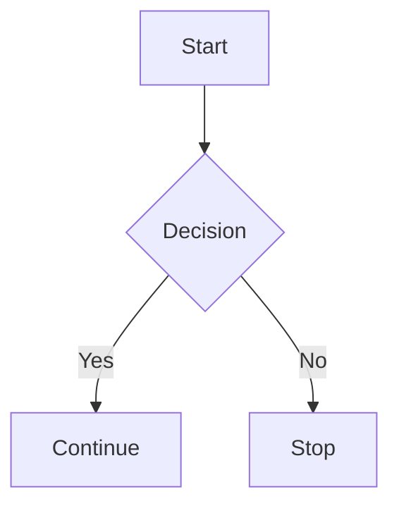

# Obsidian Markdown & Styling Reference

> A practical reference for writing beautiful, organized Obsidian notes.

## Table of Contents

- [[#1. Headings]]
- [[#2. Paragraphs and line breaks]]
- [[#3. Text styling]]
- [[#4. Lists]]
- [[#5. Checklists and tasks]]
- [[#6. Links]]
- [[#7. Images and media]]
- [[#8. Tables]]
- [[#9. Blockquotes]]
- [[#10. Code]]
- [[#11. Horizontal rules]]
- [[#12. Callouts]]
- [[#13. Wikilinks and embeds]]
- [[#14. Footnotes]]
- [[#15. Comments]]
- [[#16. Tags]]
- [[#17. YAML frontmatter and properties]]
- [[#18. Dates and templates]]
- [[#19. Math and equations]]
- [[#20. HTML]]
- [[#21. Icons and symbols]]
- [[#22. Beautiful note layouts]]
- [[#23. CSS classes and snippets]]
- [[#24. Plugin-dependent features]]
- [[#25. Quick reference]]

---

# 1. Headings

```markdown
# Heading 1
## Heading 2
### Heading 3
#### Heading 4
##### Heading 5
###### Heading 6
```

Use headings to organize your note:

```markdown
# Project Name

## Overview

### Goals

### Tasks

## Notes

## References
```

---

# 2. Paragraphs and line breaks

## Normal paragraph

```markdown
This is a normal paragraph.

This is a second paragraph.
```

## Line break

```markdown
First line  
Second line
```

You can also use HTML:

```html
First line<br>
Second line
```

## Escape Markdown characters

Add a backslash before a Markdown character:

```markdown
\*Not italic\*
\# Not a heading
\[Not a link\]
\> Not a quote
```

Common characters to escape:

```text
\ * _ # + - . ! [ ] ( ) { } > |
```

---

# 3. Text styling

## Bold

```markdown
**Bold text**
__Bold text__
```

Result: **Bold text**

## Italic

```markdown
*Italic text*
_Italic text_
```

Result: *Italic text*

## Bold and italic

```markdown
***Bold and italic***
___Bold and italic___
```

Result: ***Bold and italic***

## Strikethrough

```markdown
~~Strikethrough text~~
```

Result: ~~Strikethrough text~~

## Highlight

Obsidian supports:

```markdown
==Highlighted text==
```

Result: ==Highlighted text==

## Inline code

```markdown
Use `inline code` inside a sentence.
```

Result: Use `inline code` inside a sentence.

## Combining styles

```markdown
**Bold and _italic_**

==**Important highlighted text**==

~~**Completed but important**~~

`**This stays as code**`
```

## Markdown inside text

```markdown
**Bold**, *italic*, ==highlighted==, and ~~struck~~.
```

---

# 4. Lists

## Bullet list

```markdown
- Item one
- Item two
- Item three
```

Alternative bullet characters:

```markdown
* Item one
+ Item two
- Item three
```

## Numbered list

```markdown
1. First item
2. Second item
3. Third item
```

You can use repeated `1.`:

```markdown
1. First item
1. Second item
1. Third item
```

## Nested list

```markdown
- Main item
  - Nested item
    - Deeply nested item
  - Another nested item
- Another main item
```

## Mixed list

```markdown
1. Main step
   - Detail
   - Another detail
2. Second step
   1. Substep
   2. Another substep
```

## Task list inside a list

```markdown
- [ ] Main task
  - [ ] Subtask
  - [x] Completed subtask
- [x] Completed main task
```

## Definition-style list

Markdown does not have universal definition-list syntax, but this works visually:

```markdown
**Term**

: Definition of the term.
```

Or:

```markdown
**Term:** Definition of the term.
```

---

# 5. Checklists and tasks

## Unchecked task

```markdown
- [ ] Task to do
```

## Checked task

```markdown
- [x] Completed task
```

## Checklist with details

```markdown
- [ ] Prepare report
  - [ ] Gather data
  - [ ] Review results
  - [ ] Send report
```

## Task priority using symbols

```markdown
- [ ] 🔴 High-priority task
- [ ] 🟡 Medium-priority task
- [ ] 🟢 Low-priority task
```

## Task status examples

```markdown
- [ ] Not started
- [/] In progress
- [x] Done
- [-] Cancelled
- [?] Waiting
- [!] Important
```

> The extra task characters depend on your Obsidian theme, plugins, or CSS snippets. The standard Markdown checkbox is `- [ ]` and `- [x]`.

---

# 6. Links

## External link

```markdown
[Open Google](https://www.google.com)
```

## Automatic URL

```markdown
https://www.google.com
```

## Email link

```markdown
[Email me](mailto:someone@example.com)
```

## Link with title

```markdown
[Open website](https://example.com "Website title")
```

## Link to a heading in the same note

```markdown
[Jump to Headings](#1-headings)
```

## Link to a heading in another note

```markdown
[[Note Name#Heading]]
```

## Link with custom display text

```markdown
[[Note Name|My custom text]]
```

## Link to a block

```markdown
[[Note Name#^block-id]]
```

## Block ID

Add a block ID to a paragraph:

```markdown
This paragraph can be linked directly. ^my-block
```

Then link to it:

```markdown
[[Note Name#^my-block]]
```

## Link to a file

```markdown
[Download file](file:///C:/Path/to/file.pdf)
```

> File links may behave differently depending on your operating system and Obsidian settings.

---

# 7. Images and media

## External image

```markdown

```

## Image with title

```markdown

```

## Resize an image

Obsidian syntax:

```markdown
![[image.png|300]]
```

Width and height:

```markdown
![[image.png|300x200]]
```

## Embed a local image

```markdown
![[image.png]]
```

## Embed an image from a note

```markdown
![[Note Name#Image section]]
```

## Embed audio

```markdown
![[audio.mp3]]
```

## Embed video

```markdown
![[video.mp4]]
```

## Embed a PDF

```markdown
![[document.pdf]]
```

Specific PDF page:

```markdown
![[document.pdf#page=3]]
```

## Embed another note

```markdown
![[Note Name]]
```

## Embed a heading from another note

```markdown
![[Note Name#Heading]]
```

## Embed a block

```markdown
![[Note Name#^block-id]]
```

---

# 8. Tables

## Basic table

```markdown
| Name | Role | Status |
| --- | --- | --- |
| Alice | Developer | Active |
| Bob | Designer | Pending |
```

## Left, center, and right alignment

```markdown
| Left | Center | Right |
| :--- | :----: | ---: |
| A | B | C |
| D | E | F |
```

## Table with formatting

```markdown
| Feature | Description | Status |
| --- | --- | --- |
| **Login** | User authentication | ==Done== |
| *Reports* | Generate reports | In progress |
| `API` | Backend integration | Planned |
```

## Table with links

```markdown
| Resource | Link |
| --- | --- |
| Documentation | [Open](https://example.com) |
| Project | [[Project Note]] |
```

## Table with checkboxes

```markdown
| Task | Complete |
| --- | --- |
| Design | [x] |
| Code | [ ] |
```

## Table tips

- Keep column names short.
- Use `<br>` for line breaks inside cells.
- Avoid very long paragraphs inside tables.
- Tables do not support every Markdown feature consistently.
- For complex layouts, consider callouts, HTML, or a plugin.

---

# 9. Blockquotes

## Basic quote

```markdown
> This is a quote.
```

## Multi-line quote

```markdown
> First line.
> Second line.
> Third line.
```

## Nested quote

```markdown
> Outer quote
>> Nested quote
```

## Quote with formatting

```markdown
> **Important:** Remember to save your work.
```

## Quote with attribution

```markdown
> "The secret of getting ahead is getting started."
>
> — Mark Twain
```

---

# 10. Code

## Inline code

```markdown
Use `SELECT * FROM Users` in SQL.
```

## Fenced code block

````markdown
```text
This is a code block.
```
````

## Code block with language

````markdown
```csharp
public class Person
{
    public string Name { get; set; }
}
```
````

## JavaScript

````markdown
```javascript
const message = "Hello";
console.log(message);
```
````

## TypeScript

````markdown
```typescript
interface User {
  id: number;
  name: string;
}
```
````

## SQL

````markdown
```sql
SELECT *
FROM Users
WHERE IsActive = 1;
```
````

## JSON

````markdown
```json
{
  "name": "Example",
  "active": true
}
```
````

## HTML

````markdown
```html
<div class="card">Hello</div>
```
````

## CSS

````markdown
```css
.card {
  padding: 1rem;
  border-radius: 12px;
}
```
````

## Bash / PowerShell

````markdown
```bash
git status
```

```powershell
Get-ChildItem
```
````

## Diff blocks

````markdown
```diff
- Removed line
+ Added line
```
````

## Mermaid diagrams

````markdown

````

## Code comments

````markdown
```csharp
// Single-line comment

/*
   Multi-line comment
*/
```
````

---

# 11. Horizontal rules

```markdown
---
```

```markdown
***
```

```markdown
___
```

Use them to separate sections:

```markdown
## Section One

Content.

---

## Section Two

More content.
```

---

# 12. Callouts

Obsidian callouts are one of the best ways to make notes beautiful.

## Basic callout

```markdown
> [!note]
> This is a note callout.
```

## Common callout types

```markdown
> [!note]
> General information.

> [!abstract]
> Summary or abstract.

> [!info]
> Useful information.

> [!todo]
> A task or to-do.

> [!tip]
> Helpful tip.

> [!success]
> Successful result.

> [!check]
> Completed item.

> [!question]
> A question.

> [!warning]
> Warning message.

> [!failure]
> Failed result.

> [!danger]
> Dangerous or critical information.

> [!bug]
> Bug information.

> [!example]
> Example content.

> [!quote]
> Quoted content.
```

## Callout with a title

```markdown
> [!tip] Useful Tip
> Save frequently to avoid losing work.
```

## Callout with no title

```markdown
> [!info]
> This callout has no custom title.
```

## Foldable callout

Collapsed by default:

```markdown
> [!note]- Click to expand
> Hidden content goes here.
```

Open by default:

```markdown
> [!note]+ Click to collapse
> Visible content goes here.
```

## Nested callout

```markdown
> [!note] Outer callout
> Outer content.
>
> > [!tip] Nested callout
> > Nested content.
```

## Callout with a list

```markdown
> [!todo] Checklist
> - [ ] First task
> - [ ] Second task
> - [x] Completed task
```

## Callout with code

````markdown
> [!example] Example
>
> ```sql
> SELECT *
> FROM Users;
> ```
````

## Callout with a table

```markdown
> [!info] Status
>
> | Item | Status |
> | --- | --- |
> | Build | Done |
> | Tests | Pending |
```

## Custom callout types

Themes and CSS snippets can define custom callouts. For example:

```markdown
> [!my-custom-callout] Custom title
> Custom content.
```

The appearance depends on your theme or CSS.

---

# 13. Wikilinks and embeds

## Link to a note

```markdown
[[Note Name]]
```

## Custom link text

```markdown
[[Note Name|Open this note]]
```

## Link to a heading

```markdown
[[Note Name#Heading]]
```

## Link to a heading with custom text

```markdown
[[Note Name#Heading|Read this section]]
```

## Link to a block

```markdown
[[Note Name#^block-id]]
```

## Link to a tag

```markdown
[[#tag-name]]
```

## Embed a note

```markdown
![[Note Name]]
```

## Embed a heading

```markdown
![[Note Name#Heading]]
```

## Embed a block

```markdown
![[Note Name#^block-id]]
```

## Embed a search

```markdown
```query
tag:#project
```
```

## Embed a search with a phrase

```markdown
```query
"important project"
```
```

---

# 14. Footnotes

## Basic footnote

```markdown
This sentence has a footnote.[^1]

[^1]: This is the footnote text.
```

## Named footnote

```markdown
This sentence has a note.[^source]

[^source]: Source information goes here.
```

## Inline footnote

```markdown
This sentence has an inline note. ^[This is an inline footnote.]
```

## Multiple footnotes

```markdown
First note.[^one]

Second note.[^two]

[^one]: First footnote.
[^two]: Second footnote.
```

---

# 15. Comments

## Inline comment

```markdown
Visible text %%hidden comment%%
```

## Multi-line comment

```markdown
%%
This entire section is hidden
in Reading view.
%%
```

Comments are useful for:

- Reminders to yourself.
- Draft notes.
- Internal instructions.
- Temporary content.
- Explanations that should not appear in Reading view.

---

# 16. Tags

## Inline tag

```markdown
#project
#work
#coding
```

## Nested tag

```markdown
#project/client-a
#work/meeting
#coding/sql
```

## Tags with numbers

```markdown
#2026
#version-2
```

## Tags in frontmatter

```yaml
---
tags:
  - project
  - work
  - reference
---
```

## Search for tags

```query
tag:#project
```

---

# 17. YAML frontmatter and properties

## Basic frontmatter

```yaml
---
title: My Note
author: Your Name
date: 2026-09-17
tags:
  - notes
  - reference
---
```

## Common property types

```yaml
---
title: Example Note
status: In Progress
priority: High
completed: false
count: 10
rating: 5
created: 2026-09-17
updated: 2026-09-17
aliases:
  - Example
  - Sample Note
tags:
  - example
  - notes
cssclasses:
  - clean-note
---
```

## Date properties

```yaml
---
created: 2026-09-17
updated: 2026-09-17
due: 2026-09-30
---
```

## Aliases

```yaml
---
aliases:
  - SQL Notes
  - Database Notes
---
```

## CSS classes

```yaml
---
cssclasses:
  - wide-page
  - clean-note
---
```

> CSS classes require a matching theme rule or CSS snippet.

---

# 18. Dates and templates

## Date links

```markdown
[[2026-09-17]]
```

## Link to today's daily note

```markdown
[[{{date}}]]
```

## Core Templates plugin variables

Common template syntax:

```markdown
{{title}}
{{date}}
{{time}}
```

## Templater plugin examples

> These require the Templater community plugin.

```markdown
<% tp.file.title %>
<% tp.date.now("YYYY-MM-DD") %>
<% tp.date.now("dddd, MMMM Do YYYY") %>
<% tp.file.creation_date("YYYY-MM-DD") %>
```

## Useful date formats

```text
YYYY-MM-DD
YYYY-MM-DD HH:mm
dddd, MMMM Do YYYY
MMM D, YYYY
```

---

# 19. Math and equations

Obsidian supports LaTeX math.

## Inline math

```markdown
The formula is $E=mc^2$.
```

## Block math

```markdown
$$
E = mc^2
$$
```

## Fractions

```markdown
$$
\frac{a}{b}
$$
```

## Square root

```markdown
$$
\sqrt{x}
$$
```

## Superscript and subscript

```markdown
$$
x^2
$$

$$
H_2O
$$
```

## Greek letters

```markdown
$$
\alpha + \beta = \gamma
$$
```

## Matrix

```markdown
$$
\begin{bmatrix}
1 & 2 \\
3 & 4
\end{bmatrix}
$$
```

## Aligned equations

```markdown
$$
\begin{aligned}
a &= b + c \\
d &= e + f
\end{aligned}
$$
```

---

# 20. HTML

Obsidian allows many HTML elements.

## Bold HTML

```html
<strong>Bold text</strong>
```

## Italic HTML

```html
<em>Italic text</em>
```

## Underline

```html
<u>Underlined text</u>
```

## Highlight

```html
<mark>Highlighted text</mark>
```

## Small text

```html
<small>Small text</small>
```

## Center text

```html
<center>Centered text</center>
```

## Text color

```html
<span style="color: red;">Red text</span>
```

```html
<span style="color: #4CAF50;">Green text</span>
```

## Background color

```html
<span style="background-color: yellow;">Highlighted background</span>
```

## Combined styling

```html
<span style="color: #ffffff; background-color: #6a5acd; padding: 4px 8px; border-radius: 6px;">
  Beautiful label
</span>
```

## Collapsible HTML section

```html
<details>
<summary>Click to expand</summary>

Hidden content goes here.

</details>
```

## HTML table

```html
<table>
  <tr>
    <th>Name</th>
    <th>Status</th>
  </tr>
  <tr>
    <td>Project A</td>
    <td>Active</td>
  </tr>
</table>
```

## Line break

```html
<br>
```

## Divider

```html
<hr>
```

> HTML rendering can vary by theme and Obsidian version. Avoid unsafe or unsupported HTML.

---

# 21. Icons and symbols

## Emoji icons

You can paste emojis directly into notes:

```markdown
🚀 Project
📌 Important
✅ Complete
❌ Failed
⚠️ Warning
💡 Idea
📝 Notes
📅 Date
⏰ Reminder
🔥 High priority
⭐ Favorite
🎯 Goal
🔗 Link
📁 Folder
📄 Document
💻 Code
🐛 Bug
🔍 Research
📊 Report
🧠 Learning
🛠️ Tools
🔒 Private
🌱 Growth
```

## Useful status icons

```markdown
🟢 Active
🟡 Pending
🔴 Blocked
🔵 Information
⚪ Not started
🟣 In review
```

## Unicode symbols

```markdown
→  ←  ↑  ↓
⇒  ⇐  ⇑  ⇓
↗  ↘  ↙  ↖
✓  ✔  ✕  ✖
★  ☆  ◆  ◇
●  ○  ■  □
►  ▸  ◀  ◂
+  −  ×  ÷
∞  ≈  ≠  ≤  ≥
©  ®  ™
§  ¶  №
```

## Arrows

```markdown
→ Right arrow
← Left arrow
↑ Up arrow
↓ Down arrow
↔ Two-way arrow
⇒ Implies
⇢ Leads to
➜ Action
➤ Pointer
```

## Box-drawing symbols

Useful for visual diagrams:

```text
┌───────┐
│ Box   │
└───────┘

├───────┤
└───────┘
│
▼
```

## Simple visual separators

```markdown
✦ ───────── ✦
◆ ───────── ◆
━━━━━━━━━━━━
• • • • • • •
════════════
```

## Icon plugins

For richer icons, consider community plugins such as:

- Iconize
- Style Settings
- Emoji Toolbar
- Advanced Tables
- Admonition (older callout workflow)
- Buttons
- Templater

Plugin availability and syntax may change. Check each plugin's documentation.

---

# 22. Beautiful note layouts

## Title banner

```markdown
# 🚀 Project Dashboard

> [!info] Overview
> A central place for project status, tasks, and links.
```

## Status card

```markdown
> [!success] Project Status
> **Status:** 🟢 Active
>
> **Owner:** Your Name
>
> **Due date:** 2026-09-30
```

## Two-column-style layout using callouts

```markdown
> [!info] Left Column
> Content for the first area.

> [!tip] Right Column
> Content for the second area.
```

> True columns generally require a theme, CSS snippet, or plugin.

## Dashboard layout

```markdown
# 📊 Dashboard

## Quick Links

- [[Projects]]
- [[Tasks]]
- [[Meetings]]
- [[Reference]]

---

## Today's Focus

- [ ] Important task
- [ ] Second task
- [ ] Review notes

---

## Status

> [!success] Completed
> 5 tasks completed.

> [!warning] Pending
> 2 tasks still need attention.
```

## Meeting note layout

```markdown
# 📅 Meeting — 2026-09-17

## Attendees

- Person A
- Person B

## Agenda

1. Topic one
2. Topic two

## Discussion

> [!note] Key discussion
> Important details.

## Decisions

- Decision one
- Decision two

## Action Items

- [ ] Action item — Owner — Due date

## Follow-up

- [[Related Note]]
```

## Project note layout

```markdown
# 🚀 Project Name

> [!info] Summary
> One-sentence project summary.

## Goals

- Goal one
- Goal two

## Tasks

- [ ] Task one
- [ ] Task two

## Notes

## Risks

> [!warning] Risk
> Describe the risk and mitigation.

## Links

- [[Related Project]]
- [Documentation](https://example.com)
```

## Study note layout

```markdown
# 🧠 Topic Name

## Definition

> [!abstract] Definition
> Explain the topic in one or two sentences.

## Key Concepts

- Concept one
- Concept two

## Example

```text
Example goes here.
```

## Questions

- [ ] What does this mean? 🆔 00o8jz
- [ ] How is it used?

## Summary

> [!tip] Remember
> The most important idea.
```

## Personal journal layout

```markdown
# 🌱 Daily Journal — 2026-09-17

## Mood

😊

## Grateful For

- Something
- Something else

## Wins

- Win one

## Challenges

- Challenge one

## Tomorrow

- [ ] One priority
```

---

# 23. CSS classes and snippets

## Assign a CSS class to a note

In frontmatter:

```yaml
---
cssclasses:
  - wide-page
---
```

## Multiple classes

```yaml
---
cssclasses:
  - wide-page
  - clean-note
  - dashboard
---
```

## Example CSS snippet

Save as a `.css` snippet in your Obsidian snippets folder:

```css
/* Wide note content */
.wide-page .markdown-preview-view,
.wide-page .markdown-source-view {
  max-width: 1100px;
  margin: auto;
}

/* Clean note headings */
.clean-note h1 {
  border-bottom: 2px solid var(--interactive-accent);
  padding-bottom: 0.3em;
}

/* Rounded callouts */
.clean-note .callout {
  border-radius: 14px;
}

/* Custom label */
.custom-label {
  display: inline-block;
  padding: 4px 8px;
  border-radius: 8px;
  background: var(--background-secondary);
  font-weight: 600;
}
```

Use it in a note:

```html
<span class="custom-label">Important</span>
```

> CSS snippets are optional and require enabling them in Obsidian Settings → Appearance → CSS snippets.

---

# 24. Plugin-dependent features

These features are not all part of core Markdown or core Obsidian.

## Dataview

Example:

```dataview
TABLE file.mtime AS "Modified"
FROM ""
SORT file.mtime DESC
LIMIT 10
```

## Dataview task query

```dataview
TASK
FROM ""
WHERE !completed
SORT file.mtime DESC
```

## Dataview list query

```dataview
LIST
FROM #project
SORT file.name ASC
```

## Tasks plugin

Example syntax varies by plugin settings:

```markdown
- [ ] Finish report 📅 2026-09-30
```

## Buttons

Buttons require the Buttons plugin and its syntax.

## Kanban

Kanban boards require the Kanban plugin.

## Excalidraw

Excalidraw drawings require the Excalidraw plugin.

## Charts

Charts may require a chart plugin or code block supported by your setup.

## Advanced Tables

Advanced Tables improves table editing and formatting.

## Style Settings

Style Settings allows theme-specific customization.

## Templater

Templater provides dynamic templates and JavaScript-based automation.

## QuickAdd

QuickAdd helps automate note creation and commands.

## Meta Bind

Meta Bind provides interactive controls and fields.

Always check the installed plugin's documentation for the exact current syntax.

---

# 25. Quick reference

## Text

```markdown
**bold**
*italic*
***bold italic***
~~strikethrough~~
==highlight==
`inline code`
```

## Structure

```markdown
# Heading
## Heading
---
> Quote
```

## Lists

```markdown
- Bullet
1. Number
- [ ] Unchecked
- [x] Checked
```

## Links

```markdown
[Website](https://example.com)
[[Note]]
[[Note#Heading]]
```

## Media

```markdown

![[image.png]]
![[video.mp4]]
![[document.pdf]]
```

## Table

```markdown
| A | B |
| --- | --- |
| 1 | 2 |
```

## Code

````markdown
```javascript
console.log("Hello");
```
````

## Callout

```markdown
> [!tip] Tip
> Helpful information.
```

## Footnote

```markdown
Text.[^1]

[^1]: Footnote.
```

## Comment

```markdown
%% Hidden comment %%
```

## Tag

```markdown
#tag
#parent/child
```

## Properties

```yaml
---
title: Note
tags:
  - example
---
```

## Math

```markdown
$E=mc^2$

$$
\frac{a}{b}
$$
```

## Embed

```markdown
![[Note]]
![[Note#Heading]]
![[Note#^block-id]]
```

---

# Final styling tips

1. Use headings consistently.
2. Use callouts for important information.
3. Use emojis sparingly as visual labels.
4. Use short paragraphs for readability.
5. Use tables for comparisons, not long explanations.
6. Use checklists for actionable work.
7. Use links to connect related notes.
8. Use tags for broad categories.
9. Use properties for structured metadata.
10. Use CSS snippets only when you need custom styling.
11. Keep a consistent color and icon system.
12. Use whitespace to make notes easier to scan.
13. Prefer simple layouts over overly decorative ones.
14. Use collapsible callouts for optional details.
15. Review plugin syntax before relying on plugin-specific features.

> [!success] You now have a reusable Markdown and Obsidian styling reference.
> Copy examples from this note whenever you need to create clean, beautiful, organized notes.
