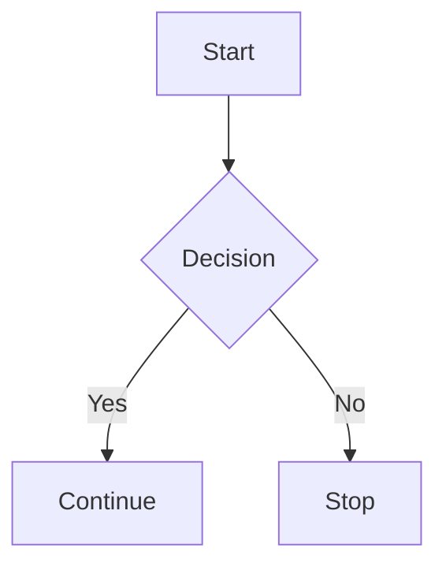

# ✨ Obsidian Markdown Style Gallery

This file is designed to be **read directly inside Obsidian**.

Each section has:

- A **live example** showing how it looks.
- A **copyable syntax** showing what to type.
- A few practical styling ideas.

---

# 1. Headings

## Heading 2

### Heading 3

#### Heading 4

##### Heading 5

###### Heading 6

**Copyable syntax**

```markdown
# Heading 1
## Heading 2
### Heading 3
#### Heading 4
##### Heading 5
###### Heading 6
```

---

# 2. Text styling

## Bold

**This is bold text.**

Syntax: `**This is bold text.**`

## Italic

*This is italic text.*

Syntax: `*This is italic text.*`

## Bold and italic

***This is bold and italic.***

Syntax: `***This is bold and italic.***`

## Strikethrough

~~This text is crossed out.~~

Syntax: `~~This text is crossed out.~~`

## Highlight

==This text is highlighted.==

Syntax: `==This text is highlighted.==`

## Inline code

Use `SELECT * FROM Users` inside a sentence.

Syntax: ``Use `SELECT * FROM Users` inside a sentence.``

## Combined styling

==**Important highlighted text**==

*This is* **bold**, ~~crossed out~~, and `code`.
~~hammad-- 

---

# 3. Paragraphs and separators

This is a normal paragraph.

This is a second paragraph with a blank line between them.

First line  
Second line using two spaces.

---

**Copyable syntax**

```markdown
First paragraph.

Second paragraph.

First line  
Second line

---
```

---

# 4. Bullet lists

- First item
- Second item
- Third item

## Nested bullets

- Main item
  - Nested item
  - Another nested item
    - Deeply nested item
- Another main item

**Copyable syntax**

```markdown
- First item
- Second item
- Third item

- Main item
  - Nested item
  - Another nested item
    - Deeply nested item
- Another main item
```

---

# 5. Numbered lists

1. First step
2. Second step
3. Third step

## Mixed lists

1. Main step
   - Detail one
   - Detail two
2. Second step
   1. Substep one
   2. Substep two

**Copyable syntax**

```markdown
1. First step
2. Second step
3. Third step

1. Main step
   - Detail one
   - Detail two
2. Second step
   1. Substep one
   2. Substep two
```

---

# 6. Checklists

- [ ] Unfinished task
- [x] Completed task

## Project checklist

- [ ] Plan the work
  - [ ] Gather requirements
  - [ ] Create a design
  - [ ] Review the design
- [x] Create the project
- [ ] Test the project

## Task status symbols

- [ ] 🔴 High priority
- [ ] 🟡 Medium priority
- [ ] 🟢 Low priority
- [x] ✅ Completed

**Copyable syntax**

```markdown
- [ ] Unfinished task
- [x] Completed task

- [ ] Plan the work
  - [ ] Gather requirements
  - [ ] Create a design
  - [ ] Review the design
```

- [ ] Unfinished task
---

# 7. Links

## External link

[Open Google](https://www.google.com)

## Link to another note

[[Example Note]]

## Custom note link text

[[Example Note|Open my example note]]

## Link to a heading

[[Example Note#Overview]]

## Link to a heading with custom text

[[Example Note#Overview|Read the overview]]

## Link to a block

[[Example Note#^my-block]]

**Copyable syntax**

```markdown
[Open Google](https://www.google.com)

[[Example Note]]

[[Example Note|Open my example note]]

[[Example Note#Overview]]

[[Example Note#Overview|Read the overview]]

[[Example Note#^my-block]]
```

---

# 8. Images and media

## Image from a URL


## Local image

![[image.png]]

## Resize local image

![[image.png|300]]

## Resize by width and height

![[image.png|300x200]]

## Embed audio

![[audio.mp3]]

## Embed video

![[video.mp4]]

## Embed PDF

![[document.pdf]]

**Copyable syntax**

```markdown


![[image.png]]

![[image.png|300]]

![[image.png|300x200]]

![[audio.mp3]]

![[video.mp4]]

![[document.pdf]]
```

---

# 9. Tables

| Name | Role | Status |
| --- | --- | --- |
| Alice | Developer | 🟢 Active |
| Bob | Designer | 🟡 Pending |
| Charlie | Tester | ✅ Done |

## Aligned table

| Left aligned | Center aligned | Right aligned |
| :--- | :---: | ---: |
| Text | Text | 100 |
| Text | Text | 200 |

## Table with formatting

| Feature | Description | Status |
| --- | --- | --- |
| **Login** | User authentication | ==Done== |
| `API` | Backend integration | *In progress* |
| Reports | [Documentation](https://example.com) | Planned |

**Copyable syntax**

```markdown
| Name | Role | Status |
| --- | --- | --- |
| Alice | Developer | 🟢 Active |
| Bob | Designer | 🟡 Pending |
| Charlie | Tester | ✅ Done |

| Left aligned | Center aligned | Right aligned |
| :--- | :---: | ---: |
| Text | Text | 100 |
| Text | Text | 200 |
```

---

# 10. Blockquotes

> This is a blockquote.

> **Important:** Save your work frequently.

> First line of the quote.  
> Second line of the quote.

## Nested quote

> Outer quote
>
> > Nested quote

**Copyable syntax**

```markdown
> This is a blockquote.

> **Important:** Save your work frequently.

> Outer quote
>
> > Nested quote
```

---

# 11. Callouts

Callouts are excellent for making Obsidian notes visually attractive.

> [!note] Note
> This is a standard note callout.

> [!info] Information
> This callout contains useful information.

> [!tip] Helpful tip
> Use callouts to make important ideas stand out.

> [!success] Success
> The task was completed successfully.

> [!warning] Warning
> Be careful with this operation.

> [!danger] Danger
> This is critical information.

> [!bug] Bug
> Describe a bug or unexpected behavior here.

> [!example] Example
> This is an example callout.

> [!quote] Quote
> A memorable quote goes here.

## Foldable callout

> [!note]- Click to expand
> This content starts collapsed.

> [!note]+ Click to collapse
> This content starts expanded.

## Callout with a checklist

> [!todo] Tasks
> - [ ] First task
> - [ ] Second task
> - [x] Completed task

## Callout with a table

> [!info] Project status
>
> | Item | Status |
> | --- | --- |
> | Design | Done |
> | Coding | In progress |
> | Testing | Pending |

**Copyable syntax**

```markdown
> [!note] Note
> This is a standard note callout.

> [!tip] Helpful tip
> Use callouts to make important ideas stand out.

> [!warning] Warning
> Be careful with this operation.

> [!note]- Click to expand
> This content starts collapsed.

> [!todo] Tasks
> - [ ] First task
> - [ ] Second task
> - [x] Completed task
```

---

# 12. Code

## Inline code

Use `SELECT * FROM Users` in a SQL note.

## C#

```csharp
public class Person
{
    public string Name { get; set; }
}
```

## SQL

```sql
SELECT *
FROM Users
WHERE IsActive = 1;
```

## JavaScript

```javascript
const message = "Hello";
console.log(message);
```

## JSON

```json
{
  "name": "Example",
  "active": true
}
```

## HTML

```html
<div class="card">Hello</div>
```

## CSS

```css
.card {
  padding: 1rem;
  border-radius: 12px;
}
```

## PowerShell

```powershell
Get-ChildItem
```

## Diff

```diff
- Removed line
+ Added line
```

## Mermaid diagram



**Copyable syntax**

````markdown
```csharp
public class Person
{
    public string Name { get; set; }
}
```

```sql
SELECT *
FROM Users
WHERE IsActive = 1;
```


````

---

# 13. Footnotes

This sentence has a footnote.[^1]

This sentence has an inline footnote. ^[This is an inline footnote.]

[^1]: This is the footnote text.

**Copyable syntax**

```markdown
This sentence has a footnote.[^1]

[^1]: This is the footnote text.

This sentence has an inline footnote. ^[This is an inline footnote.]
```

---

# 14. Comments

This text is visible. %%This comment is hidden in Reading view.%%

%%
This entire block is hidden in Reading view.
It can contain private reminders.
%%

**Copyable syntax**

```markdown
Visible text %%hidden comment%%

%%
Hidden multi-line comment.
%%
```

---

# 15. Tags

#project

#work

#coding/sql

#reference

**Copyable syntax**

```markdown
#project
#work
#coding/sql
#reference
```

---

# 16. Properties and YAML

```yaml
---
title: Example Note
description: A sample Obsidian note
author: Your Name
status: In Progress
priority: High
completed: false
created: 2026-09-17
updated: 2026-09-17
aliases:
  - Example
  - Sample Note
tags:
  - reference
  - example
cssclasses:
  - clean-note
---
```

## Common property types

| Property type | Example |
| --- | --- |
| Text | `status: Active` |
| Number | `priority: 1` |
| Boolean | `completed: false` |
| Date | `created: 2026-09-17` |
| List | `tags: [work, project]` |
| Link | `related: "[[Another Note]]"` |

---

# 17. Dates and templates

## Daily note link

[[2026-09-17]]

## Core Templates examples

```markdown
{{title}}
{{date}}
{{time}}
```

## Templater examples

```markdown
<% tp.file.title %>
<% tp.date.now("YYYY-MM-DD") %>
<% tp.date.now("dddd, MMMM Do YYYY") %>
```

> Templater syntax requires the Templater community plugin.

---

# 18. Math and equations

Inline math: $E=mc^2$

Block math:

$$
E = mc^2
$$

## Fraction

$$
\frac{a}{b}
$$

## Square root

$$
\sqrt{x}
$$

## Superscript and subscript

$$
x^2 + H_2O
$$

## Matrix

$$
\begin{bmatrix}
1 & 2 \\
3 & 4
\end{bmatrix}
$$

**Copyable syntax**

```markdown
Inline math: $E=mc^2$

$$
\frac{a}{b}
$$
```

---

# 19. HTML styling

## Underline

<u>Underlined text</u>

## Highlight

<mark>Highlighted HTML text</mark>

## Small text

<small>Small supporting text</small>

## Colored text

<span style="color: red;">Red text</span>

<span style="color: green;">Green text</span>

## Styled label

<span style="background-color: #6a5acd; color: white; padding: 4px 8px; border-radius: 8px;">Important</span>

## Collapsible section

<details>
<summary>Click to expand</summary>

This content is hidden until expanded.

</details>

**Copyable syntax**

```html
<u>Underlined text</u>

<mark>Highlighted HTML text</mark>

<small>Small supporting text</small>

<span style="color: red;">Red text</span>

<span style="background-color: #6a5acd; color: white; padding: 4px 8px; border-radius: 8px;">
  Important
</span>

<details>
<summary>Click to expand</summary>

Hidden content.

</details>
```

---

# 20. Icons and symbols

## Emoji icons

| Icon | Meaning |
| --- | --- |
| 🚀 | Project / launch |
| 📌 | Important |
| ✅ | Complete |
| ❌ | Failed |
| ⚠️ | Warning |
| 💡 | Idea |
| 📝 | Notes |
| 📅 | Date |
| ⏰ | Reminder |
| 🔥 | High priority |
| ⭐ | Favorite |
| 🎯 | Goal |
| 🔗 | Link |
| 📁 | Folder |
| 📄 | Document |
| 💻 | Code |
| 🐛 | Bug |
| 🔍 | Research |
| 📊 | Report |
| 🧠 | Learning |
| 🛠️ | Tools |
| 🔒 | Private |
| 🌱 | Growth |

## Status icons

🟢 Active

🟡 Pending

🔴 Blocked

🔵 Information

⚪ Not started

🟣 In review

## Unicode symbols

### Arrows

→ ← ↑ ↓ ↔ ⇒ ⇢ ➜ ➤

### Checks

✓ ✔ ✕ ✖ ☑ ☐

### Shapes

★ ☆ ◆ ◇ ● ○ ■ □

### Math

+ − × ÷ ∞ ≈ ≠ ≤ ≥

### Legal and document symbols

© ® ™ § ¶ №

### Decorative separators

✦ ───────── ✦

◆ ───────── ◆

━━━━━━━━━━━━

• • • • • • •

════════════

## Icon plugins

For actual icon libraries, look at community plugins such as:

- Iconize
- Emoji Toolbar
- Style Settings
- Buttons

Plugin syntax varies by plugin and version.

---

# 21. Beautiful note examples

## Project dashboard

# 🚀 Project Dashboard

> [!info] Overview
> A central place for project status, tasks, and links.

## Quick links

- [[Projects]]
- [[Tasks]]
- [[Meetings]]
- [[Reference]]

## Today's focus

- [ ] Important task
- [ ] Review code
- [ ] Update documentation 🆔 3yvl6e

## Status

> [!success] Completed
> 5 tasks completed.

> [!warning] Pending
> 2 tasks still need attention.

---

## Meeting note

# 📅 Meeting — 2026-09-17

## Attendees

- Person A
- Person B

## Agenda

1. Topic one
2. Topic two

> [!note] Key discussion
> Important details from the meeting.

## Decisions

- Decision one
- Decision two

## Action items

- [ ] Action item — Owner — Due date

## Follow-up

- [[Related Note]]

---

## Coding note

# 💻 Coding Notes

> [!abstract] Summary
> A short explanation of the problem and solution.

## Problem

Describe the problem here.

## Solution

```csharp
public void Example()
{
    // Code goes here
}
```

## SQL

```sql
SELECT *
FROM ExampleTable;
```

## Things to remember

> [!tip] Tip
> Keep reusable code examples in one place.

## Related notes

- [[CSharp]]
- [[SQL]]
- [[Debugging]]

---

## Study note

# 🧠 Study Note

> [!abstract] Definition
> Explain the topic in one or two sentences.

## Key concepts

- Concept one
- Concept two
- Concept three

## Example

> [!example] Example
> Add a practical example here.

## Questions

- [ ] What does this mean?
- [ ] How is it used?
- [ ] What should I review?

## Summary

> [!tip] Remember
> Write the most important idea here.

---

# 22. Plugin-dependent syntax

These features require community plugins or special configurations.

## Dataview

```dataview
TABLE file.mtime AS "Modified"
FROM ""
SORT file.mtime DESC
LIMIT 10
```

## Dataview task query

```dataview
TASK
FROM ""
WHERE !completed
SORT file.mtime DESC
```

## Dataview list query

```dataview
LIST
FROM #project
SORT file.name ASC
```

Other useful plugins include:

- Templater
- Tasks
- Dataview
- Advanced Tables
- Kanban
- Excalidraw
- Buttons
- QuickAdd
- Meta Bind
- Style Settings

---

# 23. Quick copy reference

## Text

```markdown
**bold**
*italic*
***bold italic***
~~strikethrough~~
==highlight==
`inline code`
```

## Structure

```markdown
# Heading
## Heading
---
> Quote
```

## Lists

```markdown
- Bullet
1. Number
- [ ] Unchecked
- [x] Checked
```

## Links

```markdown
[Website](https://example.com)
[[Note]]
[[Note#Heading]]
[[Note|Custom text]]
```

## Media

```markdown

![[image.png]]
![[video.mp4]]
![[document.pdf]]
```

## Table

```markdown
| A | B |
| --- | --- |
| 1 | 2 |
```

## Code

````markdown
```javascript
console.log("Hello");
```
````

## Callout

```markdown
> [!tip] Tip
> Helpful information.
```

## Footnote

```markdown
Text.[^1]

[^1]: Footnote.
```

## Comment

```markdown
%% Hidden comment %%
```

## Tag

```markdown
#tag
#parent/child
```

## Properties

```yaml
---
title: Note
tags:
  - example
---
```

## Math

```markdown
$E=mc^2$

$$
\frac{a}{b}
$$
```

## Embed

```markdown
![[Note]]
![[Note#Heading]]
![[Note#^block-id]]
```

---

# Final styling advice

- Use headings to create a clear hierarchy.
- Use callouts for important information.
- Use emojis as visual labels.
- Use tables for comparisons.
- Use checklists for tasks.
- Use properties for structured metadata.
- Use links to connect related notes.
- Use short paragraphs and plenty of whitespace.
- Keep your icon and color choices consistent.
- Use CSS snippets only when you need custom layouts.
- Keep a simple version of each note before making it highly decorative.

> [!success] Reference complete
> This file is intended to be viewed directly in Obsidian. The examples above are rendered examples, while the copyable syntax sections show what to type.
